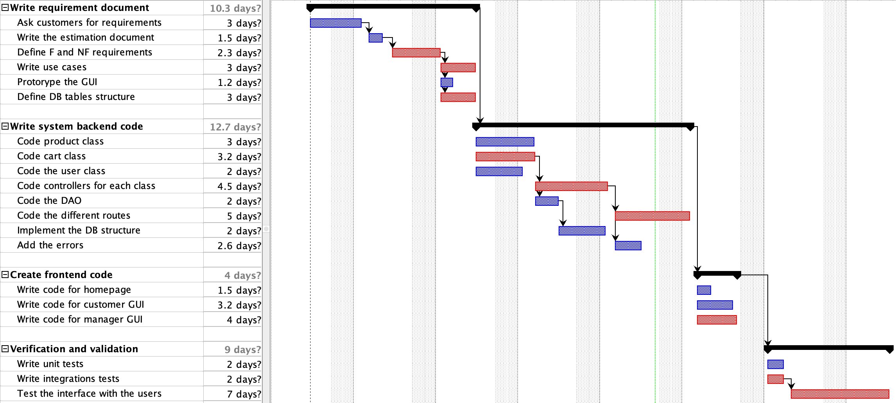

# Project Estimation - CURRENT

Date: April 23rd, 2024

Version: V1

# Estimation approach

Consider the EZElectronics project in CURRENT version (as given by the teachers), assume that you are going to develop the project INDEPENDENT of the deadlines of the course, and from scratch

# Estimate by size

|                                                                                                         | Estimate |
| :-----------------------------------------------------------------------------------------------------: | :------: |
|                            NC = Estimated number of classes to be developed                             |    8     |
|                              A = Estimated average size per class, in LOC                               |   250    |
|                            S = Estimated size of project, in LOC (= NC \* A)                            |   2000   |
|          E = Estimated effort, in person hours (here use productivity 10 LOC per person hour)           |   200    |
|                   C = Estimated cost, in euro (here use 1 person hour cost = 30 euro)                   |   6000   |
| Estimated calendar time, in calendar weeks (Assume team of 4 people, 8 hours per day, 5 days per week ) | 1,2 week |

# Estimate by product decomposition

|    component name    | Estimated effort (person hours) |
| :------------------: | :-----------------------------: |
| requirement document |               72                |
|    GUI prototype     |               20                |
|   design document    |               18                |
|         code         |               120               |
|      unit tests      |               15                |
|      api tests       |                2                |
| management documents |               10                |

# Estimate by activity decomposition

|        Activity name        | Estimated effort (person hours) |
| :-------------------------: | :-----------------------------: |
| Write requirement document  |               93                |
|  Write system backend code  |               114               |
|    Create frontend code     |               36                |
| Verification and validation |               81                |

### Gantt

# Summary

Report here the results of the three estimation approaches. The estimates may differ. Discuss here the possible reasons for the difference

|                                    | Estimated effort | Estimated duration |
| :--------------------------------: | :--------------: | :----------------: |
|          estimate by size          |       200        |     1,2 weeks      |
| estimate by product decomposition  |       257        |     1.6 weeks      |
| estimate by activity decomposition |       324        |      2 weeks       |

Reasons for differences:

- **estimation techniques**: each approach utilizes a different method for estimating effort and duration. The "Estimate by Size" focuses on sizing the project based on lines of code, function points, or other size-related metrics. In contrast, "Estimate by Product Decomposition" breaks down the project into its components or features, while "Estimate by Activity Decomposition" decomposes the project into its constituent activities.
- **scope and complexity**: the three approaches consider different aspects of the project's scope and complexity. For instance, "Estimate by Product Decomposition" may account for additional features or modules that were not captured in the other approaches. Likewise, "Estimate by Activity Decomposition" might delve deeper into the activities required for development, leading to a more detailed estimation.
- **level of detail**: the granularity of estimation varies across the approaches. "Estimate by Size" might provide a high-level overview based on size metrics, while "Estimate by Activity Decomposition" likely offers a more detailed breakdown of individual tasks and activities. This difference in granularity can lead to variations in the estimated effort and duration.
