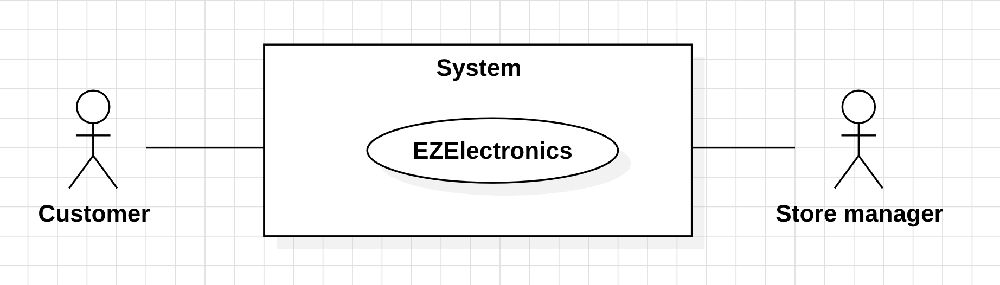
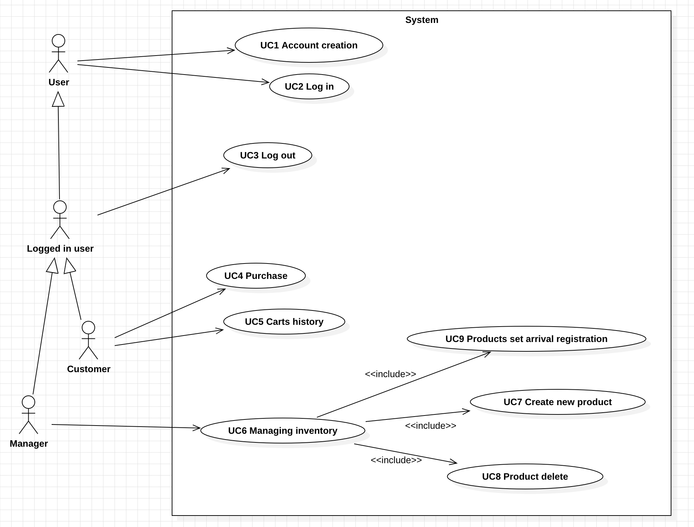
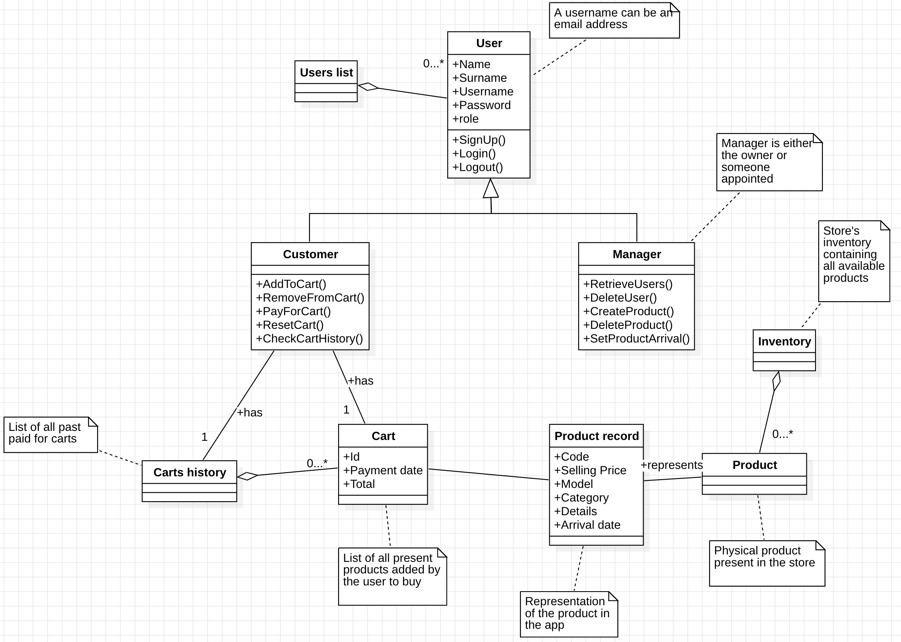
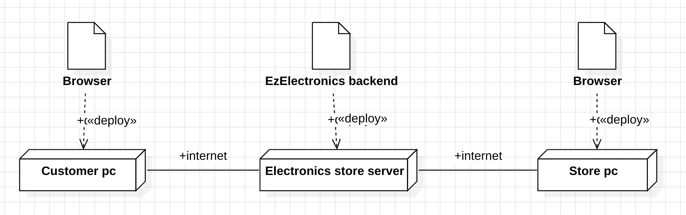

# Requirements Document - current EZElectronics

Date:

Version: V1 - description of EZElectronics in CURRENT form (as received by teachers)

| Version number | Change |
| :------------: | :----: |
|      0.1       |   13   |

# Contents

- [Requirements Document - current EZElectronics](#requirements-document---current-ezelectronics)
- [Contents](#contents)
- [Informal description](#informal-description)
- [Stakeholders](#stakeholders)
- [Context Diagram and interfaces](#context-diagram-and-interfaces)
  - [Context Diagram](#context-diagram)
  - [Interfaces](#interfaces)
- [Stories and personas](#stories-and-personas)
- [Functional and non functional requirements](#functional-and-non-functional-requirements)
  - [Functional Requirements](#functional-requirements)
  - [Non Functional Requirements](#non-functional-requirements)
  - [Table of rights](#table-of-rights)
- [Use case diagram and use cases](#use-case-diagram-and-use-cases)
  - [Use case diagram](#use-case-diagram)
    - [Use case 1, UC1 : Account creation](#use-case-1-uc1--account-creation)
      - [Scenario acc_creation_1](#scenario-acc_creation_1)
      - [Scenario acc_creation_2](#scenario-acc_creation_2)
      - [Scenario acc_creation_3](#scenario-acc_creation_3)
    - [Use case 2, UC2 : Log in](#use-case-2-uc2--log-in)
      - [Scenario log_in_1 : customer login](#scenario-log_in_1--customer-login)
      - [Scenario log_in_2 : manager login](#scenario-log_in_2--manager-login)
      - [Scenario log_in_3 : username not found](#scenario-log_in_3--username-not-found)
      - [Scenario log_in_4 : wrong password](#scenario-log_in_4--wrong-password)
    - [Use case 3, UC3 : Log out](#use-case-3-uc3--log-out)
      - [Scenario log_out_1 : Successful logout](#scenario-log_out_1--successful-logout)
    - [Use case 4, UC4 : Purchase](#use-case-4-uc4--purchase)
      - [Scenario buy_1 : customer completes an order](#scenario-buy_1--customer-completes-an-order)
      - [Scenario buy_2 : customer deletes a product from the cart](#scenario-buy_2--customer-deletes-a-product-from-the-cart)
      - [Scenario buy_3 : customer deletes the current cart](#scenario-buy_3--customer-deletes-the-current-cart)
      - [Scenario buy_4 : product already in the cart](#scenario-buy_4--product-already-in-the-cart)
      - [Scenario buy_5 : product already sold](#scenario-buy_5--product-already-sold)
      - [Scenario buy_6 : empty cart](#scenario-buy_6--empty-cart)
      - [Scenario buy_7 : product id non existing](#scenario-buy_7--product-id-non-existing)
    - [Use case 5, UC5 : Carts history](#use-case-5-uc5--carts-history)
      - [Scenario past_carts_1](#scenario-past_carts_1)
    - [Use case 6, UC6 : Managing inventory](#use-case-6-uc6--managing-inventory)
    - [Use case 7, UC7 : Create new product](#use-case-5-uc5--carts-history)
      - [Scenario new_product_1](#scenario-new_product_1)
      - [Scenario new_product_2](#scenario-new_product_2)
      - [Scenario new_product_3](#scenario-new_product_3)
    - [Use case 8, UC8 : Product delete](#use-case-8-uc8--product-delete)
      - [Scenario del_product_1](#scenario-del_product_1)
      - [Scenario del_product_2](#scenario-del_product_2)
    - [Use case 9, UC9 : Products set arrival registration](#use-case-9-uc9--products-set-arrival-registration)
      - [Scenario new_set_arrival_1](#scenario-new_set_arrival_1)
      - [Scenario new_set_arrival_2](#scenario-new_set_arrival_2)
- [Glossary](#glossary)
- [Deployment Diagram](#deployment-diagram)

# Informal description

EZElectronics (read EaSy Electronics) is a software application designed to help managers of electronics stores to manage their products and offer them to customers through a dedicated website.
Managers can assess the available products, record new ones, and confirm purchases.
Customers can see available products, add them to a cart and see the history of their past purchases.

## Business Model for EzElectronics

### Value Proposition

- **Streamlined Product Management:**
  EZElectronics offers electronics store managers an intuitive tool to easily manage their product inventory.
- **Online Shopping Experience:**
  For customers, EZElectronics provides the convenience of browsing and purchasing electronic products through a dedicated website, with features like viewing available products, adding them to the cart, and viewing purchase history.

### Customer Segments

- **Electronics Store Managers:**
  Store administrators looking to simplify inventory management and offer their customers an online shopping experience.
- **Electronics Store Customers:**
  Customers who want to explore and purchase electronic products from online stores conveniently.

### Channels

- **Website:**
  EZElectronics will be accessible via a dedicated website, through which store managers and customers can access their respective functionalities.

### Revenue Streams

- **Transaction Fees:**
  EZElectronics may charge a commission on each transaction completed through the platform

### Key Resources

- **Software Platform:**
  Development and maintenance of the software platform are key resources for EZElectronics.

### Cost Structure

- **Software Development and Maintenance:**
  Investment in platform software development and maintenance.

# Stakeholders

| Stakeholder name |                                                                                                                      Description                                                                                                                       |
| :--------------: | :----------------------------------------------------------------------------------------------------------------------------------------------------------------------------------------------------------------------------------------------------: |
|     Customer     | Customers visiting the EZElectronics website can browse and buy electronic products. They can view products, add them to their cart, and check their purchase history. Customers want easiness in finding products and a seamless shopping experience. |
|  Store manager   |                    Store managers oversee the electronics store's operations using the EZElectronics software. They manage products, track inventory, and handle purchases. Store managers can add new products and approve sales.                     |

# Context Diagram and interfaces

## Context Diagram

## Interfaces

|     Actor     |                                              Logical Interface                                               | Physical Interface |
| :-----------: | :----------------------------------------------------------------------------------------------------------: | :----------------: |
|   Customer    | (GUI to be defined - see available products, add them to a cart and see the history of their past purchases) |   PC/smartphone    |
| Store manager |         (GUI to be defined - assess the available products, record new ones, and confirm purchases)          |   PC/smartphone    |

# Stories and personas

**Murad, the store manager**: "I want a comprehensive system to efficiently manage our inventory, streamline customer interactions, and monitor user activity on our website."

**User Story:**
As a store manager, I need a user-friendly interface to manage inventory effectively.
When new products arrive, I want to easily register them into our system to keep our inventory up-to-date.
This will ensure that our customers have access to the latest products.
Additionally, I need the ability to control which products are visible to customers on our website.
This includes adding new products for display and removing products that are out of stock or discontinued.
By having this control, I can ensure that our online storefront accurately reflects our available inventory.
Furthermore, I require the capability to mark carts as paid once transactions are completed.
This feature will help in keeping track of sales and ensuring that orders are processed efficiently.

**Sarah, Customer**: "I desire a seamless and intuitive experience while shopping on the website."

**User Story:**
As a customer, I want to easily explore and add products to my cart while browsing the website.
I expect to see a variety of products categorized by type or model, facilitating a smooth navigation experience.
When adding products to my cart, I anticipate a simple and efficient process that allows me to quickly gather items for purchase.
Once I've selected all desired items, I should be able to proceed to checkout seamlessly.
During the checkout process, I desire a clear and user-friendly interface that guides me through the necessary steps to finalize my order.
This includes reviewing my cart, confirming my selections, and proceeding with the checkout process.
After completing checkout, I appreciate having access to the history of my past carts.
This feature enables me to track previous purchases and easily revisit items I've previously considered.

# Functional and non functional requirements

## Functional Requirements

|          ID           |                  Description                  |
| :-------------------: | :-------------------------------------------: |
| FR 1: Authentication  |                                               |
|        FR 1.1         |                     Login                     |
|        FR 1.2         |                    Logout                     |
|  FR 2: Manage users   |                                               |
|        FR 2.1         |                Create new user                |
|        FR 2.2         |                Register roles                 |
|        FR 2.3         |              Retrieve user data               |
| FR 3: Manage products |                                               |
|        FR 3.1         |              Create new products              |
|        FR 3.2         |             Retrieve all products             |
|        FR 3.3         |                Delete Products                |
|        FR 3.4         |     Register arrival of a set of products     |
|        FR 3.5         |             Mark product as sold              |
|        FR 3.6         |             Retrieve all products             |
|   FR 4: Manage cart   |                                               |
|        FR 4.1         |             Retrieve User's Cart              |
|        FR 4.2         |         Add/Remove Product from Cart          |
|        FR 4.3         |             Return carts history              |
|        FR 4.4         |                  Delete Cart                  |
|        FR 4.5         | Retrieves all products of a specific category |
|        FR 4.6         |  Retrieves all products of a specific model   |
|        FR 4.7         |            Checkout the user cart             |

## Non Functional Requirements

|  ID  |      Type       |                                                                             Description                                                                             |                                Refers to                                |
| :--: | :-------------: | :-----------------------------------------------------------------------------------------------------------------------------------------------------------------: | :---------------------------------------------------------------------: |
| NFR1 |   Performance   |                              The website and system should load quickly (< 0.5 sec) and respond to user actions promptly (< 0.3 sec).                               | All functionalities (authentication, product management, shopping cart) |
| NFR2 |    Security     |               User data (login credentials) must be encrypted and secure (All traffic should use HTTPS & the password must be hashed before storing).               |                    User accounts, payment processing                    |
| NFR3 |    Usability    | The user interface for both customers and managers should be intuitive and easy to navigate (all functionalities must NOT require more than 5 clicks for the user). |                           All functionalities                           |
| NFR4 | Maintainability |                                 The system code should be well-structured, documented, and easy to modify for future enhancements.                                  |                           All functionalities                           |

## Table of rights

|  Actors  | FR1 | FR2 | FR3.1 | FR3.2 | FR3.3 | FR3.4 | FR3.5 | FR3.6 | FR4.1 | FR4.2 | FR4.3 | FR4.4 | FR4.5 | FR4.6 | FR4.7 |
| :------: | :-: | :-: | :---: | :---: | :---: | :---: | :---: | :---: | :---: | :---: | :---: | :---: | :---: | :---: | :---: |
| Customer |  Y  |  Y  |   N   |   Y   |   N   |   N   |   N   |   Y   |   Y   |   Y   |   Y   |   Y   |   Y   |   Y   |   Y   |
| Manager  |  Y  |  Y  |   Y   |   Y   |   Y   |   Y   |   Y   |   Y   |   N   |   Y   |   N   |   N   |   Y   |   Y   |   N   |

# Use case diagram and use cases

## Use case diagram

### Use case 1, UC1 : Account creation

**Informal description**: User wants to create an account in the website

| Actors Involved  |            Customer, manager             |
| :--------------: | :--------------------------------------: |
|   Precondition   |     The user doesn't have an account     |
|  Post condition  |       The user account is created        |
| Nominal Scenario |    acc_creation_1 (customer sign up)     |
|     Variants     |     acc_creation_2 (manager sign up)     |
|    Exceptions    | acc_creation_3 (username already in use) |

##### Scenario acc_creation_1

| Scenario acc_creation_1 |                     Customer sign up                      |
| :---------------------: | :-------------------------------------------------------: |
|      Precondition       |           The customer doesn't have and account           |
|     Post condition      |             The customer's account is created             |
|          Step#          |                        Description                        |
|            1            |                 User : fills in username                  |
|            2            |                   User : fills in name                    |
|            3            |                  User : fills in surname                  |
|            4            |                 User : fills in password                  |
|            5            |             User : selects Customer as a role             |
|            6            |                  User : submits the form                  |
|            7            | System : checks if all the fields of the form are present |
|            8            |     System : checks if the username is already in use     |
|            9            |     System : the account is created, notify customer      |

##### Scenario acc_creation_2

| Scenario acc_creation_2 |                      Manager sign up                      |
| :---------------------: | :-------------------------------------------------------: |
|      Precondition       |           The manager doesn't have and account            |
|     Post condition      |               The manager has a new account               |
|          Step#          |                        Description                        |
|            1            |                 User : fills in username                  |
|            2            |                   User : fills in name                    |
|            3            |                  User : fills in surname                  |
|            4            |                 User : fills in password                  |
|            5            |             User : selects Manager as a role              |
|            6            |                  User : submits the form                  |
|            7            | System : checks if all the fields of the form are present |
|            8            |     System : checks if the username is already in use     |
|            9            |      System: the account is created, notify manager       |

##### Scenario acc_creation_3

| Scenario acc_creation_3 |                          User sign up                          |
| :---------------------: | :------------------------------------------------------------: |
|      Precondition       |               The user doesn't have and account                |
|     Post condition      |   The user is notified of the username already in use error    |
|          Step#          |                          Description                           |
|            1            |                    User : fills in username                    |
|            2            |                      User : fills in name                      |
|            3            |                    User : fills in surname                     |
|            4            |                    User : fills in password                    |
|            5            |               User : selects Customer as a role                |
|            6            |                    User : submits the form                     |
|            7            |   System : checks if all the fields of the form are present    |
|            8            |       System : checks if the username is already in use        |
|            9            | System: the chosen username is already in use, notify the user |

### Use case 2, UC2 : Log in

**Informal description**: The user wants to log in the website

| Actors Involved  |                    Customer, Manager                     |
| :--------------: | :------------------------------------------------------: |
|   Precondition   |                 The user has an account                  |
|  Post condition  |                  The user is logged in                   |
| Nominal Scenario |                log_in_1 (customer log in)                |
|     Variants     |            log_in_2 (manager manager log in)             |
|    Exceptions    | log_in_3 (username not found), log_in_4 (wrong password) |

##### Scenario log_in_1 : customer login

| Scenario log_in_1 |                           Customer log in                           |
| :---------------: | :-----------------------------------------------------------------: |
|   Precondition    |                     The customer has an account                     |
|  Post condition   |                      The customer is logged in                      |
|       Step#       |                             Description                             |
|         1         |                   User : fills in username field                    |
|         2         |                   User : fills in password field                    |
|         3         |                       User : submits the form                       |
|         4         |      System : checks if all the fields of the form are present      |
|         5         | System : checks if the the username corresponds to an existing user |
|         6         |         System: checks if the inserted password is correct          |
|         7         |             System : the user is logged in, notify user             |

##### Scenario log_in_2 : manager login

| Scenario log_in_2 |                           Manager log in                            |
| :---------------: | :-----------------------------------------------------------------: |
|   Precondition    |                     The manager has an account                      |
|  Post condition   |                      The manager is logged in                       |
|       Step#       |                             Description                             |
|         1         |                  Manager : fills in username field                  |
|         2         |                  Manager : fills in password field                  |
|         3         |                     Manager : submits the form                      |
|         4         |      System : checks if all the fields of the form are present      |
|         5         | System : checks if the the username corresponds to an existing user |
|         6         |         System: checks if the inserted password is correct          |
|         7         |             System : the user is logged in, notify user             |

##### Scenario log_in_3 : username not found

| Scenario log_in_3 |                     Username not found                      |
| :---------------: | :---------------------------------------------------------: |
|   Precondition    |                            None                             |
|  Post condition   |         The user is notified of the wrong username          |
|       Step#       |                         Description                         |
|         1         |               User : fills in username field                |
|         2         |               User : fills in password field                |
|         3         |                   User : submits the form                   |
|         4         |  System : checks if all the fields of the form are present  |
|         5         | System : checks if the username corresponds to a known user |
|         6         | System : the specified username doesn't exist, notify user  |

##### Scenario log_in_4 : wrong password

| Scenario log_in_4 |                       Wrong password                        |
| :---------------: | :---------------------------------------------------------: |
|   Precondition    |                            None                             |
|  Post condition   |         The user is notified of the wrong password          |
|       Step#       |                         Description                         |
|         1         |               User : fills in username field                |
|         2         |               User : fills in password field                |
|         3         |                   User : submits the form                   |
|         4         |  System : checks if all the fields of the form are present  |
|         5         | System : checks if the username corresponds to a known user |
|         6         |     System : checks if the provided password is correct     |
|         7         | System : the specified password isn't correct, notify user  |

### Use case 3, UC3 : Log out

**Informal description** : The user wants to log out from the website

| Actors Involved  |                  Customer, Manager                  |
| :--------------: | :-------------------------------------------------: |
|   Precondition   | The customer is logged in, the manager is logged in |
|  Post condition  |       The user is logged out from the website       |
| Nominal Scenario |            log_out_1 (successful logout)            |
|     Variants     |                        None                         |
|    Exceptions    |                        None                         |

##### Scenario log_out_1 : Successful logout

| Scenario buy_1 |     Successful logout      |
| :------------: | :------------------------: |
|  Precondition  |   The user is logged in    |
| Post condition |   The user is logged out   |
|     Step#      |        Description         |
|       1        | User : Requests a log out  |
|       2        | System : Logs out the user |

### Use case 4, UC4 : Purchase

**Informal description** : The user wants to add one or more products he sees on the website to the shopping cart and buy them

| Actors Involved  |                                                   Customer, Manager                                                    |
| :--------------: | :--------------------------------------------------------------------------------------------------------------------: |
|   Precondition   |                                  The customer is logged in, the manager is logged in                                   |
|  Post condition  |                                            The customer completes an order                                             |
| Nominal Scenario |                                    buy_1 (customer completes an order successfully)                                    |
|     Variants     |              buy_2 (customer deletes a product from the cart), buy_3 (customer deletes the current cart)               |
|    Exceptions    | buy_4 (product already in the cart), buy_5 (product already sold), buy_6 (empty cart), buy_7 (product id non existing) |

##### Scenario buy_1 : customer completes an order

| Scenario buy_1 |                 Customer completes an order                 |
| :------------: | :---------------------------------------------------------: |
|  Precondition  |                  The customer is logged in                  |
| Post condition |                    The order is created                     |
|     Step#      |                         Description                         |
|       1        |               User : Request the current cart               |
|       2        |  System : Retrieves the current cart of the logged in user  |
|       3        |             User : Adds one product to the cart             |
|       4        | System : Checks if the added product is an existing product |
|       5        |       System : Checks if the product is already sold        |
|       6        |    System : Checks if the product is already in the cart    |
|       7        |             Optionally repeats the steps from 3             |
|       8        |             User : checks out the current cart              |
|       9        |            System : Checks if the cart is empty             |
|       10       |             System : Calculates the total price             |
|       11       |             Manager : Marks the product as sold             |

##### Scenario buy_2 : customer deletes a product from the cart

| Scenario buy_2 |          Customer deletes a product from the cart           |
| :------------: | :---------------------------------------------------------: |
|  Precondition  |                  The customer is logged in                  |
| Post condition |                    The order is created                     |
|     Step#      |                         Description                         |
|       1        |             User : Request of the current cart              |
|       2        |  System : Retrieves the current cart of the logged in user  |
|       3        |             User : Adds one product to the cart             |
|       4        | System : Checks if the added product is an existing product |
|       5        |       System : Checks if the product is already sold        |
|       6        |    System : Checks if the product is already in the cart    |
|       7        |             Optionally repeats the steps from 3             |
|       8        |            User : Removes one item from the cart            |
|       9        |           System : Removes the item from the cart           |
|       10       |             Optionally repeats the steps from 3             |
|       11       |             User : checks out the current cart              |
|       12       |            System : Checks if the cart is empty             |
|       13       |             System : Calculates the total price             |
|       14       |             Manager : Marks the product as sold             |

##### Scenario buy_3 : customer deletes the current cart

| Scenario buy_3 |              Customer deletes the current cart              |
| :------------: | :---------------------------------------------------------: |
|  Precondition  |                  The customer is logged in                  |
| Post condition |             The user's current cart is deleted              |
|     Step#      |                         Description                         |
|       1        |             User : Request of the current cart              |
|       2        |  System : Retrieves the current cart of the logged in user  |
|       3        |             User : Adds one product to the cart             |
|       4        | System : Checks if the added product is an existing product |
|       5        |       System : Checks if the product is already sold        |
|       6        |    System : Checks if the product is already in the cart    |
|       7        |             Optionally repeats the steps from 3             |
|       8        |               User : Deletes the current cart               |
|       9        |     System : Deletes the current user cart, notify user     |

##### Scenario buy_4 : product already in the cart

| Scenario buy_4 |                 Product already in the cart                 |
| :------------: | :---------------------------------------------------------: |
|  Precondition  |                  The customer is logged in                  |
| Post condition |            The product is not added to the cart             |
|     Step#      |                         Description                         |
|       1        |             User : Request of the current cart              |
|       2        |  System : Retrieves the current cart of the logged in user  |
|       3        |             User : Adds one product to the cart             |
|       4        | System : Checks if the added product is an existing product |
|       5        |       System : Checks if the product is already sold        |
|       6        |    System : Checks if the product is already in the cart    |
|       7        |  System : the product is already in the cart, notify user   |

##### Scenario buy_5 : product already sold

| Scenario buy_5 |                    Product already sold                     |
| :------------: | :---------------------------------------------------------: |
|  Precondition  |                  The customer is logged in                  |
| Post condition |            The product is not added to the cart             |
|     Step#      |                         Description                         |
|       1        |             User : Request of the current cart              |
|       2        |  System : Retrieves the current cart of the logged in user  |
|       3        |             User : Adds one product to the cart             |
|       4        | System : Checks if the added product is an existing product |
|       5        |       System : Checks if the product is already sold        |
|       6        |    System : Checks if the product is already in the cart    |
|       7        |  System : the product is already in the cart, notify user   |

##### Scenario buy_6 : empty cart

| Scenario buy_6 |                        Empty cart                         |
| :------------: | :-------------------------------------------------------: |
|  Precondition  |                 The customer is logged in                 |
| Post condition |                           None                            |
|     Step#      |                        Description                        |
|       1        |            User : Request of the current cart             |
|       2        | System : Retrieves the current cart of the logged in user |
|       3        |            User : Checks out the current cart             |
|       4        |       System : Checks if the current cart is empty        |
|       5        |      System : The current cart is empty, notify user      |

##### Scenario buy_7 : product id non existing

| Scenario buy_7 |                   Product id non existing                   |
| :------------: | :---------------------------------------------------------: |
|  Precondition  |                  The customer is logged in                  |
| Post condition |              The item is not added to the cart              |
|     Step#      |                         Description                         |
|       1        |             User : Request of the current cart              |
|       2        |  System : Retrieves the current cart of the logged in user  |
|       3        |             User : Adds one product to the cart             |
|       4        | System : Checks if the added product is an existing product |
|       5        |       System : The product doesn't exist, notify user       |

### Use case 5, UC5 : Carts history

**Informal description** : The customer goes to the past carts history page and wants to see a list of all the past carts that he paid for

| Actors Involved  |          Customer          |
| :--------------: | :------------------------: |
|   Precondition   | The customer is logged in  |
|  Post condition  | The cart history is showed |
| Nominal Scenario |       cart_history_1       |
|     Variants     |            None            |
|    Exceptions    |            None            |

##### Scenario past_carts_1

| Scenario past_carts_1 |         Looking at the past carts history          |
| :-------------------: | :------------------------------------------------: |
|     Precondition      |             The customer is logged in              |
|    Post condition     |        The past carts history is retrieved         |
|         Step#         |                    Description                     |
|           1           |       User : Asks for the past carts history       |
|           2           | System : Retrieves the customer past carts history |

### Use case 6, UC6 : Managing inventory

| Actors Involved  | Manager |
| :--------------: | :-----: |
|   Precondition   |  None   |
|  Post condition  |  None   |
| Nominal Scenario |  None   |
|     Variants     |  None   |
|    Exceptions    |  None   |

### Use case 7, UC7 : Create new product

**Informal description** : The manager wants to create a new product in the website

| Actors Involved  |                                    Manager                                     |
| :--------------: | :----------------------------------------------------------------------------: |
|   Precondition   |                     The user is a manager and is logged in                     |
|  Post condition  |                            A new product is created                            |
| Nominal Scenario |                    new_product_1 (creation of new product)                     |
|     Variants     |                                      None                                      |
|    Exceptions    | new_product_2 (product already in the db), new_product_3 (invalid arrivalDate) |

##### Scenario new_product_1

| Scenario new_product_1 |                  Creating a new product                   |
| :--------------------: | :-------------------------------------------------------: |
|      Precondition      |                 The manager is logged in                  |
|     Post condition     |                  A new product is added                   |
|         Step#          |                        Description                        |
|           1            |              Manager : inserts a new product              |
|           2            | System : checks if the product code is a new product code |
|           3            |    System : checks if the arrivalDate is a valid date     |
|           4            |       System : a new product is added, notify user        |

##### Scenario new_product_2

| Scenario new_product_2 |               Product already in the database                |
| :--------------------: | :----------------------------------------------------------: |
|      Precondition      |                   The manager is logged in                   |
|     Post condition     |             No product is added to the database              |
|         Step#          |                         Description                          |
|           1            |                 Manager : inserts a product                  |
|           2            |  System : checks if the product code is a new product code   |
|           3            | System : the product is already in the database, notify user |

##### Scenario new_product_3

| Scenario managing_inv_3 |                    Invalid arrivalDate                    |
| :---------------------: | :-------------------------------------------------------: |
|      Precondition       |                 The manager is logged in                  |
|     Post condition      |                  A new product is added                   |
|          Step#          |                        Description                        |
|            1            |                Manager : inserts a product                |
|            2            | System : checks if the product code is a new product code |
|            3            |    System : checks if the arrivalDate is a valid date     |
|            4            |     System : the arrivalDate is invalid, notify user      |

### Use case 8, UC8 : Product delete

**Informal description** : The manager wants to delete a product from the website

| Actors Involved  |                Manager                 |
| :--------------: | :------------------------------------: |
|   Precondition   | The user is a manager and is logged in |
|  Post condition  |         The product is deleted         |
| Nominal Scenario |   del_product_1 (delete successful)    |
|     Variants     |                  None                  |
|    Exceptions    | del_product_2 (product not in the db)  |

##### Scenario del_product_1

| Scenario del_product_1 |                   Delete successful                    |
| :--------------------: | :----------------------------------------------------: |
|      Precondition      |                The manager is logged in                |
|     Post condition     |            The selected product is deleted             |
|         Step#          |                      Description                       |
|           1            |              Manager : deletes a product               |
|           2            | System : checks if the product code is a known product |
|           3            |      System : the product is deleted, notify user      |

##### Scenario del_product_2

| Scenario del_product_2 |                       Product not in the database                       |
| :--------------------: | :---------------------------------------------------------------------: |
|      Precondition      |                        The manager is logged in                         |
|     Post condition     |                          No product is deleted                          |
|         Step#          |                               Description                               |
|           1            |                       Manager : deletes a product                       |
|           2            |         System : checks if the product code is a known product          |
|           3            | System : the specified product code is not in the database, notify user |

### Use case 9, UC9 : Products set arrival registration

**Informal description**: The manager wants to register the arrival of a set of products all of the same model

| Actors Involved  |                    Manager                     |
| :--------------: | :--------------------------------------------: |
|   Precondition   |     The user is a manager and is logged in     |
|  Post condition  | The arrival of the set of products in recorded |
| Nominal Scenario |   new_set_arrival (successful registration)    |
|     Variants     |                      None                      |
|    Exceptions    |    new_set_arrival_2 (invalid arrivalDate)     |

##### Scenario new_set_arrival_1

| Scenario new_set_arrival_1 |                      Successful registration                       |
| :------------------------: | :----------------------------------------------------------------: |
|        Precondition        |                      The manager is logged in                      |
|       Post condition       |                  The set of products is recorded                   |
|           Step#            |                            Description                             |
|             1              |       Manager : inserts the arrival of a new set of products       |
|             2              |    System : checks if the provided arrivalDate is a valid date     |
|             3              | System : the set of products is added to the database, notify user |

##### Scenario new_set_arrival_2

| Scenario new_set_arrival_2 |                     Invalid arrivalDate                     |
| :------------------------: | :---------------------------------------------------------: |
|        Precondition        |                  The manager is logged in                   |
|       Post condition       |               The set of products is recorded               |
|           Step#            |                         Description                         |
|             1              |   Manager : inserts the arrival of a new set of products    |
|             2              | System : checks if the provided arrivalDate is a valid date |
|             3              |     System : the arrivalDate is not valid, notify user      |

# Glossary

# Deployment Diagram

