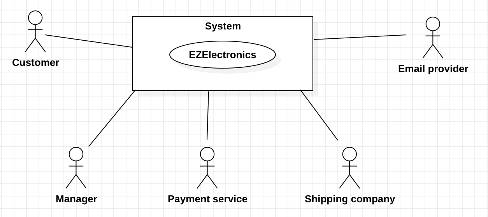
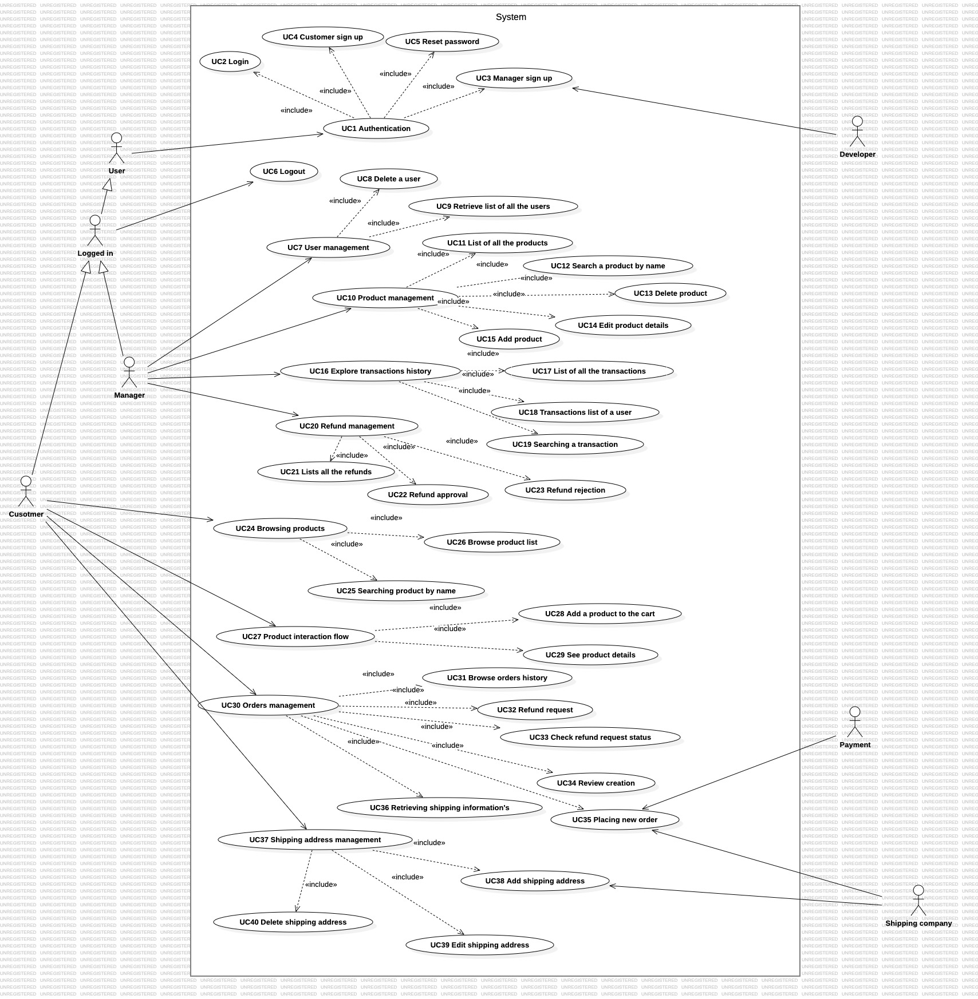
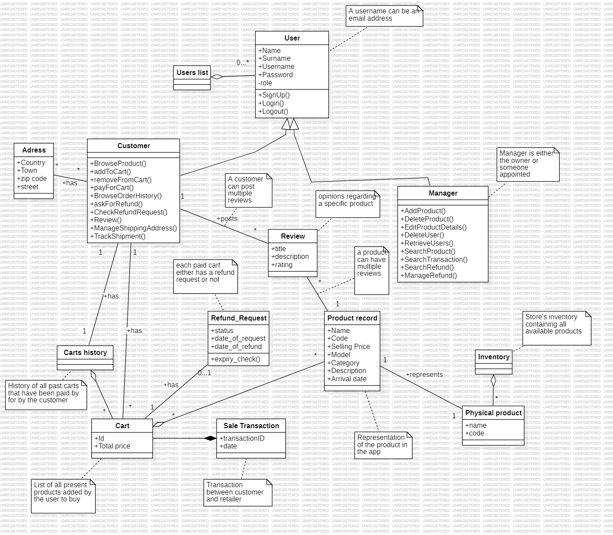
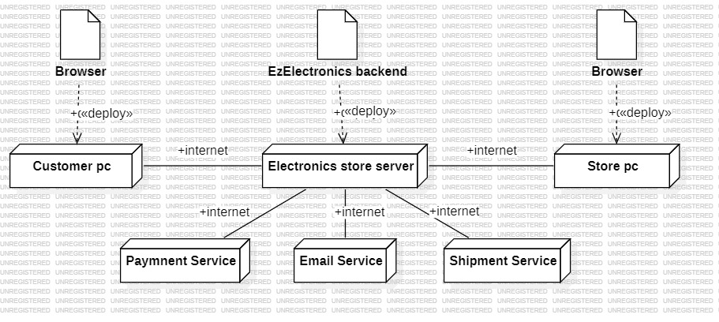

# Requirements Document - future EZElectronics

Date: 1/05/2024

Version: V1 - description of EZElectronics in FUTURE form (as proposed by the team)

| Version number | Change |
| :------------: | :----: |
|      1.0       |   33   |

# Contents

- [Informal description](#informal-description)
- [Stakeholders](#stakeholders)
- [Context Diagram](#context-diagram)
- [Interfaces](#interfaces)
- [Stories and personas](#stories-and-personas)
- [Functional Requirements](#functional-requirements)
- [Non Functional Requirements](#non-functional-requirements)
- [Table of rights](#table-of-rights)
- [Use case diagram and use cases](#use-case-diagram-and-use-cases)
  - [Use case 1 , UC1 : Authentication](#use-case-1--uc1--authentication)
  - [Use case 2, UC2 : Login](#use-case-2-uc2--login)
    - [Scenario user_log_in_1 : Successful login](#scenario-user_log_in_1--successful-login)
    - [Scenario user_log_in_2 : Wrong username](#scenario-user_log_in_2--wrong-username)
    - [Scenario user_log_in_3 : Wrong password](#scenario-user_log_in_3--wrong-password)
  - [Use case 3, UC3 : Manager sign up](#use-case-3-uc3--manager-sign-up)
    - [Scenario manager_sign_up_1](#scenario-manager_sign_up_1)
    - [Scenario manager_sign_up_2](#scenario-manager_sign_up_2)
    - [Scenario manager_sign_up_3](#scenario-manager_sign_up_3)
  - [Use case 4, UC4 : Customer sign up](#use-case-4-uc4--customer-sign-up)
    - [Scenario customer_sign_up_1 : user sign up](#scenario-customer_sign_up_1--user-sign-up)
    - [Scenario customer_sign_up_2](#scenario-customer_sign_up_2)
    - [Scenario customer_sign_up_3](#scenario-customer_sign_up_3)
  - [Use case 5, UC5 : Reset password](#use-case-5-uc5--reset-password)
    - [Scenario reset_pwd_1](#scenario-reset_pwd_1)
    - [Scenario reset_pwd_2](#scenario-reset_pwd_2)
  - [Use case 6 , UC6 : Logout](#use-case-6--uc6--logout)
    - [Scenario user_log_out_1](#scenario-user_log_out_1)
  - [Use case 7, UC7: User management](#use-case-7--uc7--user-management)
  - [Use case 8 , UC8 : Delete a user](#use-case-8--uc8--delete-a-user)
    - [Scenario del_user_1](#scenario-del_user_1)
    - [Scenario del_user_2](#scenario-del_user_2)
  - [Use case 9 , UC9 : Retrieve list of all the users](#use-case-9--uc9--retrieve-list-of-all-the-users)
    - [Scenario retrieve_all_users](#scenario-retrieve_all_users)
  - [Use case 10, UC10: Product management](#use-case-10-uc10--product-management)
  - [Use case 11, UC11 : List of all the products](#use-case-11-uc11--list-of-all-the-products)
    - [Scenario list_all_products_1](#scenario-list_all_products_1)
    - [Scenario list_all_products_2](#scenario-list_all_products_2)
  - [Use case 12, UC12 : Search a product by name](#use-case-12-uc12--search-a-product-by-name)
    - [Scenario search_product_1](#scenario-search_product_1)
    - [Scenario search_product_2](#scenario-search_product_2)
  - [Use case 13, UC13 : Delete product](#use-case-13-uc13--delete-product)
    - [Scenario delete_product_1](#scenario-delete_product_1)
  - [Use case 14, UC14 : Edit product details](#use-case-14-uc14--edit-product-details)
    - [Scenario edit_product_1](#scenario-edit_product_1)
    - [Scenario edit_product_2](#scenario-edit_product_2)
  - [Use case 15, UC15 : Add product](#use-case-15-uc15--add-product)
    - [Scenario add_product_1](#scenario-add_product_1)
    - [Scenario add_product_2](#scenario-add_product_2)
  - [Use case 16, UC16 : Explore transactions history](#use-case-16-uc16--explore-transactions-history)
  - [Use case 17, UC17 : List of all the transactions](#use-case-17-uc17--list-of-all-the-transactions)
    - [Scenario transactions_list_1](#scenario-transactions_list_1)
    - [Scenario transactions_list_2](#scenario-transactions_list_2)
  - [Use case 18, UC18 : Transactions list of a user](#use-case-18-uc18--transactions-list-of-a-user)
    - [Scenario transaction_history_of_user_1](#scenario-transaction_history_of_user_1)
  - [Use case 19, UC19 : Searching a transaction](#use-case-19-uc19--searching-a-transaction)
    - [Scenario search_transaction_1](#scenario-search_transaction_1)
    - [Scenario search_transaction_2](#scenario-search_transaction_2)
  - [Use case 20, UC20 : Refund management](#use-case-20-uc20--refund-management) -[Use case 21, UC21 : Lists all the refunds](#use-case-21-uc21--lists-all-the-refunds)
    - [Scenario refunds_list_1](#scenario-refunds_list_1)
    - [Scenario refunds_list_2](#scenario-refunds_list_2)
  - [Use case 22, UC22 : Refund approval](#use-case-22-uc22--refund-approval)
    - [Scenario approve_refund_1](#scenario-approve_refund_1)
    - [Scenario approve_refund_2](#scenario-approve_refund_2)
  - [Use case 23, UC23 : Refund rejection](#use-case-23-uc23--refund-rejection)
    - [Scenario reject_refund_1](#scenario-reject_refund_1)
  - [Use case 24, UC24 : Browsing products](#use-case-24-uc24--browsing-products)
  - [Use case 25, UC25 : Searching product by name](#use-case-25-uc25--searching-product-by-name)
    - [Scenario searching_product_by_name_1](#scenario-searching_product_by_name_1)
    - [Scenario searching_product_by_name_2](#scenario-searching_product_by_name_2)
  - [Use case 26, UC26 : Browse product list](#use-case-26-uc26--browse-product-list)
    - [Scenario product_list_1](#scenario-product_list_1)
    - [Scenario product_list_2](#scenario-product_list_2)
  - [Use case 27, UC27 : Product interaction flow](#use-case-27-uc27--product-interaction-flow)
  - [Use case 28, UC28 : Add a product to the cart](#use-case-28-uc28--add-a-product-to-the-cart)
    - [Scenario add_product_to_cart_1](#scenario-add_product_to_cart_1)
  - [Use case 29, UC29 : See product details](#use-case-29-uc29--see-product-details)
    - [Scenario product_details_1](#scenario-product_details_1)
  - [Use case 30, UC30 : Orders management](#use-case-30-uc30--orders-management)
  - [Use case 31, UC31 : Browse orders history](#use-case-31-uc31--browse-orders-history)
    - [Scenario browse_orders_history_1](#scenario-browse_orders_history_1)
    - [Scenario browse_orders_history_2](#scenario-browse_orders_history_2)
  - [Use case 32, UC32 : Refund request](#use-case-32-uc32--refund-request)
    - [Scenario refund_request_1](#scenario-refund_request_1)
    - [Scenario refund_request_2](#scenario-refund_request_2)
  - [Use case 33, UC33 : Check refund request status](#use-case-33-uc33--check-refund-request-status)
    - [Scenario refund_status_1](#scenario-refund_status_1)
    - [Scenario refund_status_2](#scenario-refund_status_2)
  - [Use case 34, UC34 : Review creation](#use-case-34-uc34--review-creation)
    - [Scenario product_review_1](#scenario-product_review_1)
    - [Scenario product_review_2](#scenario-product_review_2)
  - [Use case 35, UC35 : Placing new order](#use-case-35-uc35--placing-new-order)
    - [Scenario cart_checkout_1](#scenario-cart_checkout_1)
    - [Scenario cart_checkout_2](#scenario-cart_checkout_2)
    - [Scenario cart_checkout_3](#scenario-cart_checkout_3)
  - [Use case 36, UC36 : Retrieving shipping information's](#use-case-36-uc36--retrieving-shipping-informations)
    - [Scenario tracking_info_1](#scenario-tracking_info_1)
  - [Use case 37, UC37 : Shipping address management](#use-case-37-uc37--shipping-address-management)
  - [Use case 38, UC38 : Add shipping address](#use-case-38-uc38--add-shipping-address)
    - [Scenario add_shipping_address_1](#scenario-add_shipping_address_1)
    - [Scenario add_shipping_address_2](#scenario-add_shipping_address_2)
  - [Use case 39, UC39 : Edit shipping address](#use-case-39-uc39--edit-shipping-address)
    - [Scenario edit_shipping_address_1](#scenario-edit_shipping_address_1)
  - [Use case 40, UC40 : Delete shipping address](#use-case-40-uc40--delete-shipping-address)
    - [Scenario delete_shipping_address_1](#scenario-delete_shipping_address_1)
- [Glossary](#glossary)
- [Deployment Diagram](#deployment-diagram)

# Informal description

EZElectronics (read EaSy Electronics) is a software application designed to help managers of electronics stores to manage their products and offer them to customers through a dedicated website.
Managers can assess the available products, record new ones, and confirm purchases.
Customers can see available products, add them to a cart and see the history of their past purchases.

## Business Model for EzElectronics

### Value Proposition

- **Streamlined Product Management:**
  EZElectronics offers electronics store managers an intuitive tool to easily manage their product inventory.
- **Online Shopping Experience:**
  For customers, EZElectronics provides the convenience of browsing and purchasing electronic products through a dedicated website, with features like viewing available products, adding them to the cart, and viewing purchase history.

### Customer Segments

- **Electronics Store Managers:**
  Store administrators looking to simplify inventory management and offer their customers an online shopping experience.
- **Electronics Store Customers:**
  Customers who want to explore and purchase electronic products from online stores conveniently.

### Channels

- **Website:**
  EZElectronics will be accessible via a dedicated website, through which store managers and customers can access their respective functionalities.

### Revenue Streams

- **Transaction Fees:**
  EZElectronics may charge a commission on each transaction completed through the platform

### Key Resources

- **Software Platform:**
  Development and maintenance of the software platform are key resources for EZElectronics.
- **Personnel:**
  Technical staff for platform development and support.

### Cost Structure

- **Software Development and Maintenance:**
  Investment in platform software development and maintenance.
- **Personnel:**
  Costs for technical and marketing staff.
- **Technological Infrastructure:**
  Costs related to the necessary technological infrastructure to host and manage the platform.

# Stakeholders

|    Stakeholder name    |                                                                                                               Description                                                                                                               |
| :--------------------: | :-------------------------------------------------------------------------------------------------------------------------------------------------------------------------------------------------------------------------------------: |
|        Customer        | Customer visiting the EZElectronics website. They want to view products, add them to their cart, complete a purchase, receive the order at a specified address, check their purchase history, have the possibility to ask for a refund. |
|     Store manager      |                  The managers of the EZElectronics store. They want to manage product inventory, manage the registered users and manage all the different transactions (also by handling the various refund requests)                   |
|    Development team    |                                                                                              The team developing the EZElectronics system.                                                                                              |
|     Email provider     |                                                    The email provider responsible of handling all the emails that the EZElectronics system needs to send to the different customers.                                                    |
|    Payment service     |                                                                                   The payment service responsible of handling the customer payments.                                                                                    |
| Database administrator |                                                                               The administrator responsible for the availability of the system database.                                                                                |
|    Shipping company    |                           The shipping company handles the delivery of orders placed on EZElectronics, ensuring timely and accurate shipment to customers' addresses. They also manage the refunds shipping.                            |

# Context Diagram and interfaces

## Context Diagram

## Interfaces

|      Actor       |                                              Logical Interface                                              | Physical Interface |
| :--------------: | :---------------------------------------------------------------------------------------------------------: | :----------------: |
|     Customer     | GUI (to be defined - see available products, add them to the cart, place an order paying, ask for a refund) |         PC         |
|     Manager      |          GUI (to be defined - add/remove products, register new arrivals, handle refund requests)           |         PC         |
|  Email provider  |                                         Chosen email provider API's                                         |   Internet link    |
| Payment service  |                                        Chosen payment service API's                                         |   Internet link    |
| Shipping company |                                        Chosen shipping company API's                                        |   Internet link    |

# Stories and personas

**Tommaso, the store manager**: "I want a comprehensive system to efficiently manage our inventory, streamline customer interactions"

**User Story:**
As a store manager, I need a user-friendly interface to manage inventory effectively. When new products arrive, I want to easily register them into the system to keep our inventory up-to-date. This will ensure that our customers have access to the latest products.
Additionally, I need the ability to control which products are visible to customers on our website. This includes adding new products for display and removing products that are out of stock or discontinued.
By having this control, I can ensure that our online storefront accurately reflects our available inventory.
I also want to be able to handle refund requests in the most seamless and hassle-free way possible"

**Tony Stark, Customer**: "I desire a seamless and intuitive experience while shopping on the website."

**User Story:**
As a customer, I want to easily explore and add products to my cart while browsing the website.
I expect to see a variety of products categorized by type or model, facilitating a smooth navigation experience.
When adding products to my cart, I anticipate a simple and efficient process that allows me to quickly gather items for purchase.
Once I've selected all desired items, I should be able to proceed to checkout seamlessly.
During the checkout process, I desire a clear and user-friendly interface that guides me through the necessary steps to finalize my order.
This includes reviewing my cart, confirming my selections, and proceeding with the checkout process.
After completing checkout, I appreciate having access to the history of my past carts. This feature enables me to track previous purchases and easily revisit items I've previously considered.

# Functional and non functional requirements

## Functional Requirements

|                ID                 |               Description                |
| :-------------------------------: | :--------------------------------------: |
|       FR 1: Authentication        |                                          |
|              FR 1.1               |                  Login                   |
|              FR 1.2               |                  Logout                  |
|           FR 2: Sign up           |                                          |
|              FR 2.1               |               Registration               |
|              FR 2.2               |            Password recovery             |
| FR 3: Shipping address management |                                          |
|              FR 3.1               |          Edit shipping address           |
|              FR 3.2               |         Delete shipping address          |
|     FR 4: Product management      |                                          |
|              FR 4.1               |          Retrieve products list          |
|              FR 4.2               |          Search product by name          |
|              FR 4.3               |              Delete product              |
|              FR 4.4               |           Edit product details           |
|              FR 4.5               |          Retrieve product list           |
|              FR 4.6               |      Retrieve product information's      |
|              FR 4.7               |       Search for a product by name       |
|              FR 4.8               |       Browser products by category       |
|              FR 4.9               |        Add a product to the cart         |
|       FR 5: Review creation       |                                          |
|              FR 5.1               |              Write a review              |
|       FR 6: Cart management       |                                          |
|              FR 6.1               |             See cart details             |
|              FR 6.2               |             Checkout a cart              |
|              FR 6.3               |              Pay for a cart              |
|              FR 6.4               |         Retrieve orders history          |
|      FR 7: Transactions logs      |                                          |
|              FR 7.1               |       Search specific transaction        |
|              FR 7.2               |    Retrieve list of all transactions     |
|       FR 8: User management       |                                          |
|              FR 8.1               |              Delete a user               |
|              FR 8.2               |           Create a new manager           |
|              FR 8.3               |        Retrieve list of all users        |
|              FR 8.4               | Retrieve orders history of selected user |
|              FR 8.5               |           Add shipping address           |
|   FR 9: Refund administration:    |                                          |
|              FR 9.1               |              Ask for refund              |
|              FR 9.2               |         Approve refund requests          |
|              FR 9.3               |          Reject refund requests          |

## Non Functional Requirements

|  ID  |    Type     |                                                                                                                                                                  Description                                                                                                                                                                  |           Refers to            |
| :--: | :---------: | :-------------------------------------------------------------------------------------------------------------------------------------------------------------------------------------------------------------------------------------------------------------------------------------------------------------------------------------------: | :----------------------------: |
| NFR1 |  Usability  | Users should be able to use the website intuitively, with clear navigation and understandable interface elements (no more than 5 clicks for each function). The website should be optimized for easy use on various devices and screen sizes. Target audience: users aged 18 to 60 with diverse technical backgrounds and device preferences. | User interface, authentication |
| NFR2 | Efficiency  |                         All website functions should respond quickly to user input, with minimal latency (< 0.1 sec) for interactive elements and page loading times optimized for fast access to content. Backend processes should be optimized for efficient data retrieval and processing (query time < 0.1 sec).                          |      All functionalities       |
| NFR3 | Reliability |                                       The website should be stable and reliable, with minimal downtime and error-free operation. Measures should be in place to prevent website crashes and mitigate potential payment processing issues (possibly no downtime except 5 mins a month for maintenance).                                        |    User interface, Payment     |
| NFR4 | Portability |                                                                                           All functions should work in all browsers and devices. Minimum requirements for web browsers: Chrome 63.0, Mozilla Firefox 60.0, Opera 57.0, Safari 12.0.                                                                                           |      All functionalities       |
| NFR5 |  Security   |                                                                                                                                Protection from malicious access. Access only to authorized users (HTTPS only).                                                                                                                                |     Payment, Registration      |
| NFR6 | Scalability |                                                                               The website architecture should be designed to handle increasing user loads and accommodate future growth in traffic and data volume (at least 10000 requests at the same time).                                                                                |         All functions          |

### Table of rights

|     Actor      | FR1 | FR2 | FR3 | FR4.1 | FR4.2 | FR4.3 | FR4.4 | FR4.5 | FR4.6 | FR4.7 | FR4.8 | FR4.9 | FR5 | FR6.1 | FR6.2 | FR6.3 | FR6.4 | FR7.1 | FR7.2 | FR8.1 | FR8.2 | FR8.3 | FR8.4 | FR8.5 | FR9.1 | FR9.2 | FR9.3 |
| :------------: | :-: | :-: | :-: | :---: | :---: | :---: | :---: | :---: | :---: | :---: | :---: | :---: | :-: | :---: | :---: | :---: | :---: | :---: | :---: | :---: | :---: | :---: | :---: | :---: | :---: | :---: | :---: |
|    Customer    |  Y  |  Y  |  Y  |   Y   |   Y   |   N   |   N   |   N   |   Y   |   Y   |   Y   |   Y   |  Y  |   Y   |   Y   |   Y   |   Y   |   N   |   N   |   N   |   N   |   N   |   Y   |   Y   |   Y   |   N   |   N   |
|    Manager     |  Y  |  Y  |  N  |   Y   |   Y   |   Y   |   Y   |   Y   |   Y   |   Y   |   N   |   N   |  N  |   Y   |   N   |   N   |   Y   |   Y   |   Y   |   Y   |   Y   |   Y   |   Y   |   N   |   N   |   Y   |   Y   |
| Payment system |  N  |  N  |  N  |   N   |   N   |   N   |   N   |   N   |   N   |   N   |   N   |   N   |  N  |   N   |   N   |   Y   |   N   |   N   |   N   |   N   |   N   |   N   |   N   |   N   |   N   |   N   |   N   |
| Email provider |  N  |  Y  |  N  |   N   |   N   |   N   |   N   |   N   |   N   |   N   |   N   |   N   |  N  |   N   |   N   |   N   |   N   |   N   |   N   |   N   |   Y   |   N   |   N   |   N   |   N   |   N   |   N   |
|   Developer    |  N  |  Y  |  N  |   N   |   N   |   N   |   N   |   N   |   N   |   N   |   N   |   N   |  N  |   N   |   N   |   N   |   N   |   N   |   N   |   N   |   N   |   N   |   N   |   N   |   N   |   N   |   N   |

# Use case diagram and use cases

## Use case diagram

### Use case 1 , UC1 : Authentication

| Actors Involved  | User, Developer |
| :--------------: | :-------------: |
|   Precondition   |      None       |
|  Post condition  |      None       |
| Nominal Scenario |      None       |
|     Variants     |      None       |
|    Exceptions    |      None       |

### Use case 2, UC2 : Login

| Actors Involved  |                             User                             |
| :--------------: | :----------------------------------------------------------: |
|   Precondition   |                    User is not logged in                     |
|  Post condition  |                      User is logged in                       |
| Nominal Scenario |               user_log_in_1(Successful login)                |
|     Variants     |                             None                             |
|    Exceptions    | user_log_in_2(Wrong username), user_log_in_3(Wrong password) |

##### Scenario user_log_in_1 : Successful login

| Scenario user_log_in_1 |                 Successful login                  |
| :--------------------: | :-----------------------------------------------: |
|      Precondition      |               User it not logged in               |
|     Post condition     |                 User is logged in                 |
|         Step#          |                    Description                    |
|           1            |        User : Enters username and password        |
|           2            |     System : Checks the validity of the data      |
|           3            | System : The data is valid, the user is logged in |
|           4            |            Server : Notifies the user             |

##### Scenario user_log_in_2 : Wrong username

| Scenario user_log_in_2 |                    Wrong username                     |
| :--------------------: | :---------------------------------------------------: |
|      Precondition      |                 User it not logged in                 |
|     Post condition     |                 User is not logged in                 |
|         Step#          |                      Description                      |
|           1            |          User : Enters username and password          |
|           2            |       System : Checks the validity of the data        |
|           3            | System : The username is not valid, notifies the user |

##### Scenario user_log_in_3 : Wrong password

| Scenario user_log_in_2 |                    Wrong password                     |
| :--------------------: | :---------------------------------------------------: |
|      Precondition      |                 User is not logged in                 |
|     Post condition     |                 User is not logged in                 |
|         Step#          |                      Description                      |
|           1            |          User : Enters username and password          |
|           2            |       System : Checks the validity of the data        |
|           3            | System : The password is not valid, notifies the user |

### Use case 3, UC3 : Manager sign up

| Actors Involved  |                   Manager, Developer                   |
| :--------------: | :----------------------------------------------------: |
|   Precondition   |            Manager does not have an account            |
|  Post condition  |                 Manager has an account                 |
| Nominal Scenario |    manager_sign_up_1(Manager sign up by developer)     |
|     Variants     | manager_sign_up_2 (Manager sign up by another manager) |
|    Exceptions    |  manager_sign_up_3 (Manager username already in use)   |

##### Scenario manager_sign_up_1

| Scenario manager_sign_up_1 |                       Manager sign up by developer                        |
| :------------------------: | :-----------------------------------------------------------------------: |
|        Precondition        |                   The manager doesn't have and account                    |
|       Post condition       |                        The manager has an account                         |
|           Step#            |                                Description                                |
|             1              | Manager : Communicates to the developer the desired username and password |
|             2              |       Developer : Checks if the selected username is already in use       |
|             3              |    Developer : Adds the specified username and password to the system     |
|             4              |  Developer : Communicates to the manager the successful account creation  |

##### Scenario manager_sign_up_2

| Scenario manager_sign_up_2 |                        Manager sign up                        |
| :------------------------: | :-----------------------------------------------------------: |
|        Precondition        |               Manager2 doesn't have an account                |
|       Post condition       |                    Manager2 has an account                    |
|           Step#            |                          Description                          |
|             1              |   Manager1 : Asks to Manager2 to create an account for him    |
|             2              | Manager1 : Communicates to Manager2 the preferred credentials |
|             3              |                Manager1 : Logs into the system                |
|             4              |   Manager1 : Fills in the form for the account of Manager2    |
|             5              |           System : Checks the validity of the data            |
|             6              |   System : The new account is created, notifies the manger    |

##### Scenario manager_sign_up_3

| Scenario manager_sign_up_3 |                      Manager username already in use                      |
| :------------------------: | :-----------------------------------------------------------------------: |
|        Precondition        |                     Manager doesn't have and account                      |
|       Post condition       |                         No new account is created                         |
|           Step#            |                                Description                                |
|             1              | Manager : Communicates to the developer the desired username and password |
|             2              |       Developer : Checks if the selected username is already in use       |
|             3              |  Developer : The chosen username is already in use, notifies the manager  |

### Use case 4, UC4 : Customer sign up

| Actors Involved  |                                 Customer                                  |
| :--------------: | :-----------------------------------------------------------------------: |
|   Precondition   |                     Customer does not have an account                     |
|  Post condition  |                          Customer has an account                          |
| Nominal Scenario |                   customer_sign_up_1(Customer sign up)                    |
|     Variants     | customer_sign_up_2(Customer sign up without accepting the privacy policy) |
|    Exceptions    |                customer_sign_up_3(Username already in use)                |

##### Scenario customer_sign_up_1 : user sign up

| Scenario customer_sign_up_1 |                        Customer sign up                         |
| :-------------------------: | :-------------------------------------------------------------: |
|        Precondition         |                Customer does not have an account                |
|       Post condition        |                 The customer account is created                 |
|            Step#            |                           Description                           |
|              1              |       Customer : Enters username, name, surname and email       |
|              2              |              Customer : Enters the chosen password              |
|              3              |                 Customer : Repeats step 2 once                  |
|              4              |         Customer : Reads and accepts the privacy policy         |
|              5              |    System : Checks if the chosen username is already in use     |
|              6              |      System : Checks if the two inserted password matches       |
|              7              | System : The customer account is created, notifies the customer |

##### Scenario customer_sign_up_2

| Scenario customer_sign_up_2 |                       Customer sign up without accepting the privacy policy                        |
| :-------------------------: | :------------------------------------------------------------------------------------------------: |
|        Precondition         |                                 Customer does not have an account                                  |
|       Post condition        |                                  The customer account is created                                   |
|            Step#            |                                            Description                                             |
|              1              |                        Customer : Enters username, name, surname and email                         |
|              2              |                               Customer : Enters the chosen password                                |
|              3              |                                   Customer : Repeats step 2 once                                   |
|              4              |                               Customer : Rejects the privacy policy                                |
|              5              |                      System : Checks if the chosen username is already in use                      |
|              6              |                        System : Checks if the two inserted password matches                        |
|              7              | System : The customer account is created, registers his privacy preferences, notifies the customer |

##### Scenario customer_sign_up_3

| Scenario customer_sign_up_3 |                        Username already in use                        |
| :-------------------------: | :-------------------------------------------------------------------: |
|        Precondition         |                   Customer does not have an account                   |
|       Post condition        |                       No new account is created                       |
|            Step#            |                              Description                              |
|              1              |          Customer : Enters username, name, surname and email          |
|              2              |                 Customer : Enters the chosen password                 |
|              3              |                    Customer : Repeats step 2 once                     |
|              4              |            Customer : Reads and accepts the privacy policy            |
|              5              |       System : Checks if the chosen username is already in use        |
|              6              | System : The chosen username is already in use, notifies the customer |

### Use case 5, UC5 : Reset password

| Actors Involved  |      User, Email provider      |
| :--------------: | :----------------------------: |
|   Precondition   |      User has an account       |
|  Post condition  | User account password is reset |
| Nominal Scenario |  reset_pwd_1(Reset password)   |
|     Variants     |              None              |
|    Exception     |  reset_pwd_2(Email not found)  |

##### Scenario reset_pwd_1

| Scenario reset_pwd_1 |                                 Reset password                                  |
| :------------------: | :-----------------------------------------------------------------------------: |
|     Precondition     |                               User has an account                               |
|    Post condition    |                         User account password is reset                          |
|        Step#         |                                   Description                                   |
|          1           |                        User : Requests a password reset                         |
|          2           |             User : Inserts the email used during the sign up phase              |
|          3           |             System : Checks for the existence of the provided email             |
|          4           |                              System : Email found                               |
|          5           |          System : Sends to the email provider the message for the user          |
|          6           | Email provider : Sends to the user email the instructions to reset the password |

##### Scenario reset_pwd_2

| Scenario reset_pwd_2 |                     Email not found                     |
| :------------------: | :-----------------------------------------------------: |
|     Precondition     |                   User has an account                   |
|    Post condition    |                          None                           |
|        Step#         |                       Description                       |
|          1           |            User : Requests a password reset             |
|          2           | User : Inserts the email used during the sign up phase  |
|          3           | System : Checks for the existence of the provided email |
|          4           |       System : Email not found, notifies the user       |

### Use case 6 , UC6 : Logout

| Actors Involved  |             User             |
| :--------------: | :--------------------------: |
|   Precondition   |      User is logged in       |
|  Post condition  |      User is logged out      |
| Nominal Scenario | User_log_out_1(User log out) |
|     Variants     |             None             |
|    Exceptions    |             None             |

##### Scenario user_log_out_1

| Scenario user_log_out_1 |                  User log out                  |
| :---------------------: | :--------------------------------------------: |
|      Precondition       |               User is logged in                |
|     Post condition      |               User is logged out               |
|          Step#          |                  Description                   |
|            1            |          User: Asks to be logged out           |
|            2            | System : the user is logged out, notifies user |

### Use case 7 , UC7 : User management

| Actors Involved  | Manager |
| :--------------: | :-----: |
|   Precondition   |  None   |
|  Post condition  |  None   |
| Nominal Scenario |  None   |
|     Variants     |  None   |
|    Exceptions    |  None   |

### Use case 8 , UC8 : Delete a user

| Actors Involved  |              Manager               |
| :--------------: | :--------------------------------: |
|   Precondition   |         Manager logged in          |
|  Post condition  |            user deleted            |
| Nominal Scenario | del_user_1(Successful user delete) |
|     Variants     |                None                |
|    Exceptions    |   del_user_2(Username not found)   |

##### Scenario del_user_1

| Scenario del_user |                   Successful user delete                    |
| :---------------: | :---------------------------------------------------------: |
|   Precondition    |                    Manager is logged in                     |
|  Post condition   |              Selected user account is deleted               |
|       Step#       |                         Description                         |
|         1         |    Manager : Inserts a username of a user to be deleted     |
|         2         |    System : Checks the validity of the provided username    |
|         3         |                     System : User found                     |
|         4         | System : The selected user is deleted, notifies the manager |

##### Scenario del_user_2

| Scenario del_user_2 |                        Username not found                        |
| :-----------------: | :--------------------------------------------------------------: |
|    Precondition     |                       Manager is logged in                       |
|   Post condition    |                    No user account is deleted                    |
|        Step#        |                           Description                            |
|          1          |       Manager : Inserts a username of a user to be deleted       |
|          2          |      System : Checks the validity of the provided username       |
|          3          | System : The provided username is not valid, notifies the manger |

### Use case 9 , UC9 : Retrieve list of all the users

| Actors Involved  |               Manager                |
| :--------------: | :----------------------------------: |
|   Precondition   |       The manager is logged in       |
|  Post condition  | A list of all the users is retrieved |
| Nominal Scenario |  retrieve_all_users(Show all users)  |
|     Variants     |                 None                 |
|    Exceptions    |                 None                 |

##### Scenario retrieve_all_users

| Scenario retrieve_all_users |                    Show all users                    |
| :-------------------------: | :--------------------------------------------------: |
|        Precondition         |               The manager is logged in               |
|       Post condition        |         A list of all the users is retrieved         |
|            Step#            |                     Description                      |
|              1              |     Manager : Requests the list of all the users     |
|              2              | System : Retrieves the list, sends it to the manager |

### Use case 10, UC10 : Product management

| Actors Involved  | Manager |
| :--------------: | :-----: |
|   Precondition   |  None   |
|  Post condition  |  None   |
| Nominal Scenario |  None   |
|     Variants     |  None   |
|    Exceptions    |  None   |

### Use case 11, UC11 : List of all the products

| Actors Involved  |                  Manager                  |
| :--------------: | :---------------------------------------: |
|   Precondition   |         The manager is logged in          |
|  Post condition  | The list of all the products is retrieved |
| Nominal Scenario | list_all_products_1(List of all products) |
|     Variants     |                   None                    |
|    Exceptions    |     list_all_products_2(No products)      |

##### Scenario list_all_products_1

| Scenario list_all_products_1 |                          List of all products                           |
| :--------------------------: | :---------------------------------------------------------------------: |
|         Precondition         |                        The manager is logged in                         |
|        Post condition        |                The list of all the products is retrieved                |
|            Step#             |                               Description                               |
|              1               |             Manager : Asks for the list of all the products             |
|              2               | System : Retrieves the list of all the products, sends it to the manger |

##### Scenario list_all_products_2

| Scenario list_all_products_2 |                    No products                    |
| :--------------------------: | :-----------------------------------------------: |
|         Precondition         |             The manager is logged in              |
|        Post condition        |     The list of all the products is retrieved     |
|            Step#             |                    Description                    |
|              1               |  Manager : Asks for the list of all the products  |
|              2               | System : There's no product, notifies the manager |

### Use case 12, UC12 : Search a product by name

| Actors Involved  |                     Manager                      |
| :--------------: | :----------------------------------------------: |
|   Precondition   |             The manager is logged in             |
|  Post condition  | The selected product information's are retrieved |
| Nominal Scenario |       search_product_1 (Search successful)       |
|     Variants     |                       None                       |
|    Exceptions    |       search_product_2 (Product not found)       |

##### Scenario search_product_1

| Scenario search_product_1 |                              Search successful                              |
| :-----------------------: | :-------------------------------------------------------------------------: |
|       Precondition        |                          The manager is logged in                           |
|      Post condition       |              The selected product information's are retrieved               |
|           Step#           |                                 Description                                 |
|             1             |              Manager : Enters the name of a product to search               |
|             2             |                 System : Searches the provided product name                 |
|             2             | System : Retrieves the information's relative to the specified product name |
|             3             |               System : Sends the information's to the manager               |

##### Scenario search_product_2

| Scenario search_product_2 |                             Product not found                             |
| :-----------------------: | :-----------------------------------------------------------------------: |
|       Precondition        |                         The manager is logged in                          |
|      Post condition       |                                   None                                    |
|           Step#           |                                Description                                |
|             1             |             Manager : Enters the name of a product to search              |
|             2             |                System : Searches the provided product name                |
|             3             | System : No product is found with the provided name, notifies the manager |

### Use case 13, UC13 : Delete product

| Actors Involved  |               Manager                |
| :--------------: | :----------------------------------: |
|   Precondition   |       The manager is logged in       |
|  Post condition  |   The selected product is deleted    |
| Nominal Scenario | delete_product_1 (Successful delete) |
|     Variants     |                 None                 |
|    Exceptions    |                 None                 |

##### Scenario delete_product_1

| Scenario delete_product_1 |                   Successful delete                   |
| :-----------------------: | :---------------------------------------------------: |
|       Precondition        |               The manager is logged in                |
|      Post condition       |            The selected product is deleted            |
|           Step#           |                      Description                      |
|             1             | Manager : Asks for the details of a specific product  |
|             2             |         System : Retrieves the requested data         |
|             3             | Manager : Asks for the selected product to be deleted |
|             4             | System : The product is deleted, notifies the manager |

### Use case 14, UC14 : Edit product details

| Actors Involved  |                     Manager                     |
| :--------------: | :---------------------------------------------: |
|   Precondition   |            The manager is logged in             |
|  Post condition  | The selected product information's are modified |
| Nominal Scenario |        edit_product_1 (Successful edit)         |
|     Variants     |                      None                       |
|    Exceptions    |           edit_product_2 (Undo edit)            |

##### Scenario edit_product_1

| Scenario edit_product_1 |                        Successful edit                         |
| :---------------------: | :------------------------------------------------------------: |
|      Precondition       |                    The manager is logged in                    |
|     Post condition      |        The selected product information's are modified         |
|          Step#          |                          Description                           |
|            1            |      Manager : Asks for the details of a specific product      |
|            2            |             System : Retrieves the requested data              |
|            3            |      Manager : Edits the details of the specific product       |
|            4            | System : Registers the new information's, notifies the manager |

##### Scenario edit_product_2

| Scenario edit_product_2 |                      Undo edit                       |
| :---------------------: | :--------------------------------------------------: |
|      Precondition       |               The manager is logged in               |
|     Post condition      |             No product data is modified              |
|          Step#          |                     Description                      |
|            1            | Manager : Asks for the details of a specific product |
|            2            |        System : Retrieves the requested data         |
|            3            | Manager : Edits the details of the specific product  |
|            4            |   Manager : Goes back without confirming the edits   |

### Use case 15, UC15 : Add product

| Actors Involved  |                Manager                 |
| :--------------: | :------------------------------------: |
|   Precondition   |        The manager is logged in        |
|  Post condition  |        The new product is added        |
| Nominal Scenario |    add_product_1(New product added)    |
|     Variants     |                  None                  |
|    Exceptions    | add_product_2(Product already present) |

##### Scenario add_product_1

| Scenario add_product_1 |                              New product added                              |
| :--------------------: | :-------------------------------------------------------------------------: |
|      Precondition      |                          The manager is logged in                           |
|     Post condition     |                          The new product is added                           |
|         Step#          |                                 Description                                 |
|           1            |                   Manager : Requests to add a new product                   |
|           2            |        Manager : Fills in the form with the data of the new product         |
|           3            | System : Checks if the new product model is already present in the database |
|           4            |        System : The new product is registered, notifies the manager         |

##### Scenario add_product_2

| Scenario add_product_2 |                           Product already present                           |
| :--------------------: | :-------------------------------------------------------------------------: |
|      Precondition      |                          The manager is logged in                           |
|     Post condition     |                           No new product is added                           |
|         Step#          |                                 Description                                 |
|           1            |                   Manager : Requests to add a new product                   |
|           2            |        Manager : Fills in the form with the data of the new product         |
|           3            | System : Checks if the new product model is already present in the database |
|           4            |           System : The product model provided is already present            |
|           5            |             System : No product is added, notifies the manager              |

### Use case 16, UC16 : Explore transactions history

| Actors Involved  | Manager |
| :--------------: | :-----: |
|   Precondition   |  None   |
|  Post condition  |  None   |
| Nominal Scenario |  None   |
|     Variants     |  None   |
|    Exceptions    |  None   |

### Use case 17, UC17 : List of all the transactions

| Actors Involved  |                    Manager                    |
| :--------------: | :-------------------------------------------: |
|   Precondition   |           The manager is logged in            |
|  Post condition  | The list of all the transactions in retrieved |
| Nominal Scenario | transactions_list_1 (Full transactions list)  |
|     Variants     |                     None                      |
|    Exceptions    |     transactions_list_2 (No transactions)     |

##### Scenario transactions_list_1

| Scenario transactions_list_1 |               Full transactions list                |
| :--------------------------: | :-------------------------------------------------: |
|         Precondition         |              The manager is logged in               |
|        Post condition        |    The list of all the transactions in retrieved    |
|            Step#             |                     Description                     |
|              1               | Manager : Asks for the list of all the transactions |
|              2               |      System : The requested data is retrieved       |
|              3               |      System : The data is sent to the manager       |

##### Scenario transactions_list_2

| Scenario transactions_list_2 |                       No transactions                        |
| :--------------------------: | :----------------------------------------------------------: |
|         Precondition         |                   The manager is logged in                   |
|        Post condition        |                     No list is retrieved                     |
|            Step#             |                         Description                          |
|              1               |     Manager : Asks for the list of all the transactions      |
|              2               |           System : The requested data is retrieved           |
|              3               | System : The transaction list is empty, notifies the manager |

### Use case 18, UC18 : Transactions list of a user

| Actors Involved  |                         Manager                          |
| :--------------: | :------------------------------------------------------: |
|   Precondition   |                 The manager is logged in                 |
|  Post condition  | All the transactions of the selected users are retrieved |
| Nominal Scenario | transaction_history_of_user_1(User transaction history)  |
|     Variants     |                           None                           |
|    Exceptions    |                           None                           |

##### Scenario transaction_history_of_user_1

| Scenario transaction_history_of_user_1 |                           User transaction history                            |
| :------------------------------------: | :---------------------------------------------------------------------------: |
|              Precondition              |                           The manager is logged in                            |
|             Post condition             |           All the transactions of the selected users are retrieved            |
|                 Step#                  |                                  Description                                  |
|                   1                    |              Manager : Asks for the history of all transactions               |
|                   2                    |          System : The list is retrieved and returned to the manager           |
|                   3                    | Manager : Selects a specific username from a specific transaction in the list |
|                   4                    |   System : Retrieves the history of all the transactions of the chosen user   |
|                   5                    |                 System : The list is returned to the manager                  |

### Use case 19, UC19 : Searching a transaction

| Actors Involved  |                    Manager                    |
| :--------------: | :-------------------------------------------: |
|   Precondition   |           The manager is logged in            |
|  Post condition  | The selected transaction details are returned |
| Nominal Scenario |   search_transaction_1 (Successful search)    |
|     Variants     |                     None                      |
|    Exceptions    | search_transaction_2 (Transaction not found)  |

##### Scenario search_transaction_1

| Scenario search_transaction_1 |                                 Successful search                                 |
| :---------------------------: | :-------------------------------------------------------------------------------: |
|         Precondition          |                             The manager is logged in                              |
|        Post condition         |                The details of the desired transaction are returned                |
|             Step#             |                                    Description                                    |
|               1               |               Manager : Specifies a specific transaction identifier               |
|               2               |             System : Searches for the provided transaction identifier             |
|               3               | System : The chosen transaction details are retrieved and returned to the manager |

##### Scenario search_transaction_2

| Scenario search_transaction_2 |                              Transaction not found                              |
| :---------------------------: | :-----------------------------------------------------------------------------: |
|         Precondition          |                            The manager is logged in                             |
|        Post condition         |                                      None                                       |
|             Step#             |                                   Description                                   |
|               1               |              Manager : Specifies a specific transaction identifier              |
|               2               |            System : Searches for the provided transaction identifier            |
|               3               | System : The chosen transaction identifier doesn't exists, notifies the manager |

### Use case 20, UC20 : Refund management

| Actors Involved  | Manager |
| :--------------: | :-----: |
|   Precondition   |  None   |
|  Post condition  |  None   |
| Nominal Scenario |  None   |
|     Variants     |  None   |
|    Exceptions    |  None   |

### Use case 21, UC21 : Lists all the refunds

| Actors Involved  |                     Manager                      |
| :--------------: | :----------------------------------------------: |
|   Precondition   |             The manager is logged in             |
|  Post condition  | The list of all the refunds requests is provided |
| Nominal Scenario |            refunds_list_1 (Full list)            |
|     Variants     |                       None                       |
|    Exceptions    |           refunds_list_2 (Empty list)            |

##### Scenario refunds_list_1

| Scenario refunds_list_1 |                         Full list                         |
| :---------------------: | :-------------------------------------------------------: |
|      Precondition       |                 The manager is logged in                  |
|     Post condition      |     The list of all the refunds requests is provided      |
|          Step#          |                        Description                        |
|            1            |  Manager : Asks for the list of all the pending refunds   |
|            2            | System : The list of all the pending refunds is retrieved |
|            3            |         System : The data is sent to the manager          |

##### Scenario refunds_list_2

| Scenario refunds_list_2 |                         Empty list                          |
| :---------------------: | :---------------------------------------------------------: |
|      Precondition       |                  The manager is logged in                   |
|     Post condition      |                  An empty list is returned                  |
|          Step#          |                         Description                         |
|            1            |   Manager : Asks for the list of all the pending refunds    |
|            2            |  System : The list of all the pending refunds is retrieved  |
|            3            | System : There are no pending refunds, notifies the manager |

### Use case 22, UC22 : Refund approval

| Actors Involved  | Manager, Email provider, Shipping company, Payment actor |
| :--------------: | :------------------------------------------------------: |
|   Precondition   |                 The manager is logged in                 |
|  Post condition  |             The selected refund is approved              |
| Nominal Scenario |            approve_refund_1 (Refund approved)            |
|     Variants     |                           None                           |
|    Exceptions    |         approve_refund_2 (Refund window expired)         |

##### Scenario approve_refund_1

| Scenario approve_refund_1 |                                           Refund approved                                           |
| :-----------------------: | :-------------------------------------------------------------------------------------------------: |
|       Precondition        |                                      The manager is logged in                                       |
|      Post condition       |                                   The selected refund is approved                                   |
|           Step#           |                                             Description                                             |
|             1             |                       Manager : Asks for the list of all the pending refunds                        |
|             2             |                      System : The list of all the pending refunds is retrieved                      |
|             3             |                             Manager : Select a specific refund request                              |
|             4             |                           Manager : Reads the reasons behind the request                            |
|             5             |                                   Manager : Approves the request                                    |
|             6             |                    System : Checks if the requirements for the approval are met                     |
|             7             |                                   System : Registers the approval                                   |
|             8             |        System : Sends the message that has to be sent to the customer to the email provider         |
|             9             |      Email provider : Sends to the customer's inbox the instructions to ship the product back       |
|            10             |                                     System : Notifies customer                                      |
|            11             | Shipping company : The order items are received by the shipping company after the customer shipment |
|            12             |                               Shipping company : Notifies the system                                |
|            13             |                       System : Notifies the payment service to issue a refund                       |
|            14             |                       Payment service : The refund is issued to the customer                        |

##### Scenario approve_refund_2

| Scenario approve_refund_2 |                         Refund window expired                         |
| :-----------------------: | :-------------------------------------------------------------------: |
|       Precondition        |                       The manager is logged in                        |
|      Post condition       |                  The selected refund is not approved                  |
|           Step#           |                              Description                              |
|             1             |        Manager : Asks for the list of all the pending refunds         |
|             2             |       System : The list of all the pending refunds is retrieved       |
|             3             |              Manager : Select a specific refund request               |
|             4             |            Manager : Reads the reasons behind the request             |
|             5             |                    Manager : Approves the request                     |
|             6             |     System : Checks if the requirements for the approval are met      |
|             7             | System : The refund window has expired, the refund cannot be approved |
|             8             |                     System : Notifies the manager                     |

### Use case 23, UC23 : Refund rejection

| Actors Involved  |                 Manager                 |
| :--------------: | :-------------------------------------: |
|   Precondition   |        The manager is logged in         |
|  Post condition  | The selected refund request is rejected |
| Nominal Scenario |    reject_refund_1 (Refund rejected)    |
|     Variants     |                  None                   |
|    Exceptions    |                  None                   |

##### Scenario reject_refund_1

|    Scenario    |                      Refund rejected                      |
| :------------: | :-------------------------------------------------------: |
|  Precondition  |                 The manager is logged in                  |
| Post condition |          The selected refund request is rejected          |
|     Step#      |                        Description                        |
|       1        |  Manager : Asks for the list of all the pending refunds   |
|       2        | System : The list of all the pending refunds is retrieved |
|       3        |    Manager : Selects a specific request from the list     |
|       4        |   Manager : Reads the motivation for the refund request   |
|       5        |               Manager : Rejects the request               |
|       6        |    System : Registers the rejection, notifies customer    |

### Use case 24, UC24 : Browsing products

| Actors Involved  | Customer |
| :--------------: | :------: |
|   Precondition   |   None   |
|  Post condition  |   None   |
| Nominal Scenario |   None   |
|     Variants     |   None   |
|    Exceptions    |   None   |

### Use case 25, UC25 : Searching product by name

| Actors Involved  |                    Customer                     |
| :--------------: | :---------------------------------------------: |
|   Precondition   |            The customer is logged in            |
|  Post condition  |        The searched product is returned         |
| Nominal Scenario | searching_product_by_name_1 (Successful search) |
|     Variants     |                      None                       |
|    Exceptions    | searching_product_by_name_2 (product not found) |

##### Scenario searching_product_by_name_1

| Scenario searching_product_by_name_1 |                     Successful search                      |
| :----------------------------------: | :--------------------------------------------------------: |
|             Precondition             |                 The customer is logged in                  |
|            Post condition            |              The searched product is returned              |
|                Step#                 |                        Description                         |
|                  1                   |  Customer : writes in the search bar the desired product   |
|                  2                   | System : checks in the database the provided product name  |
|                  3                   | System : product found, returns the products information's |

##### Scenario searching_product_by_name_2

| Scenario searching_product_by_name_2 |                 Searching product by name                 |
| :----------------------------------: | :-------------------------------------------------------: |
|             Precondition             |                 The customer is logged in                 |
|            Post condition            |             The searched product is returned              |
|                Step#                 |                        Description                        |
|                  1                   |  Customer : writes in the search bar the desired product  |
|                  2                   | System : checks in the database the provided product name |
|                  3                   |          System : product not found, notify user          |

### Use case 26, UC26 : Browse product list

| Actors Involved  |                Customer                |
| :--------------: | :------------------------------------: |
|   Precondition   |       The customer is logged in        |
|  Post condition  |    The list of products is returned    |
| Nominal Scenario | product_list_1 (retrieve product list) |
|     Variants     |  product_list_2 (filter by category)   |
|    Exceptions    |                  None                  |

##### Scenario product_list_1

| Scenario product_list_1 |                 Retrieve product list                 |
| :---------------------: | :---------------------------------------------------: |
|      Precondition       |               The customer is logged in               |
|     Post condition      |    The information's of the products are returned     |
|          Step#          |                      Description                      |
|            1            |      Customer : requests products information's       |
|            2            |         System : retrieves the requested data         |
|            3            | System : sends products information's to the customer |

##### Scenario product_list_2

| Scenario product_list_2 |                        Filter by category                         |
| :---------------------: | :---------------------------------------------------------------: |
|      Precondition       |                     The customer is logged in                     |
|     Post condition      |          The information's of the products are returned           |
|          Step#          |                            Description                            |
|            1            | Customer : requests products information's of a specific category |
|            2            |               System : retrieves the requested data               |
|            3            |       System : sends products information's to the customer       |

### Use case 27, UC27 : Product interaction flow

| Actors Involved  | Customer |
| :--------------: | :------: |
|   Precondition   |   None   |
|  Post condition  |   None   |
| Nominal Scenario |   None   |
|     Variants     |   None   |
|    Exceptions    |   None   |

### Use case 28, UC28 : Add a product to the cart

| Actors Involved  |                     Customer                      |
| :--------------: | :-----------------------------------------------: |
|   Precondition   |             The customer is logged in             |
|  Post condition  | The selected item is added to the customer's cart |
| Nominal Scenario |      add_product_to_cart_1 (Successful add)       |
|     Variants     |                       None                        |
|    Exceptions    |                       None                        |

##### Scenario add_product_to_cart_1

| Scenario product_list_1 |                           Successful add                           |
| :---------------------: | :----------------------------------------------------------------: |
|      Precondition       |                     The customer is logged in                      |
|     Post condition      |         The selected item is added to the customer's cart          |
|          Step#          |                            Description                             |
|            1            |          Customer : add the selected product to the cart           |
|            2            | System : adds the selected product to the user's cart, notify user |
|            3            |                Optionally repeats the steps from 1                 |

### Use case 29, UC29 : See product details

| Actors Involved  |                       Customer                        |
| :--------------: | :---------------------------------------------------: |
|   Precondition   |               The customer is logged in               |
|  Post condition  |   The selected products information's are returned    |
| Nominal Scenario | product_details_1 (Successful information's retrieve) |
|     Variants     |                         None                          |
|    Exceptions    |                         None                          |

##### Scenario product_details_1

| Scenario product_details_1 |               Successful information retrieve               |
| :------------------------: | :---------------------------------------------------------: |
|        Precondition        |                  The customer is logged in                  |
|       Post condition       |      The selected products information's are returned       |
|           Step#            |                         Description                         |
|             1              |          Customer : requests for a product details          |
|             2              | System : retrieves the requested data, sends it to the user |

### Use case 30, UC30 : Orders management

| Actors Involved  | Customer |
| :--------------: | :------: |
|   Precondition   |   None   |
|  Post condition  |   None   |
| Nominal Scenario |   None   |
|     Variants     |   None   |
|    Exceptions    |   None   |

### Use case 31, UC31 : Browse orders history

| Actors Involved  |                  Customer                   |
| :--------------: | :-----------------------------------------: |
|   Precondition   |          The customer is logged in          |
|  Post condition  |  The customer orders history is retrieved   |
| Nominal Scenario | browse_orders_history_1 (History retrieved) |
|     Variants     |                    None                     |
|    Exceptions    |   browse_orders_history_2 (empty history)   |

##### Scenario browse_orders_history_1

| Scenario browse_orders_history_1 |                History retrieved                |
| :------------------------------: | :---------------------------------------------: |
|           Precondition           |            The customer is logged in            |
|          Post condition          |    The customer's cart history is retrieved     |
|              Step#               |                   Description                   |
|                1                 |      Customer : Requests the carts history      |
|                2                 |     System : The carts history is retrieved     |
|                3                 | System : The retrieved data is sent to the user |

##### Scenario browse_orders_history_2

| Scenario browse_orders_history_2 |                  Empty history                   |
| :------------------------------: | :----------------------------------------------: |
|           Precondition           |            The customer is logged in             |
|          Post condition          |  The customer is notified of the empty history   |
|              Step#               |                   Description                    |
|                1                 |      Customer : Requests the carts history       |
|                2                 |     System : The carts history is retrieved      |
|                3                 | System : The carts history is empty, notify user |

### Use case 32, UC32 : Refund request

| Actors Involved  |                   Customer                   |
| :--------------: | :------------------------------------------: |
|   Precondition   |          The customer is logged in           |
|  Post condition  |       The refound request is received        |
| Nominal Scenario | refund_request_1 (Successful refund request) |
|     Variants     |                     None                     |
|    Exceptions    |   refund_request_2 (Refund window expired)   |

##### Scenario refund_request_1

| Scenario refund_request_1 |                       Successful refund request                       |
| :-----------------------: | :-------------------------------------------------------------------: |
|       Precondition        |                       The customer is logged in                       |
|      Post condition       |                    The refund request is received                     |
|           Step#           |                              Description                              |
|             1             |              User : Asks for the list of all the orders               |
|             2             |                    User : Selects a specific order                    |
|             3             |            User : Asks for a refund of the selected order             |
|             4             | System : Checks if the delivery date of the order allows for a refund |
|             5             |         System : The refund request is received, notify user          |

##### Scenario refund_request_2

| Scenario refund_request_2 |                         Refund window expired                         |
| :-----------------------: | :-------------------------------------------------------------------: |
|       Precondition        |                       The customer is logged in                       |
|      Post condition       |                                 None                                  |
|           Step#           |                              Description                              |
|             1             |              User : Asks for the list of all the orders               |
|             2             |                    User : Selects a specific order                    |
|             3             |            User : Asks for a refund of the selected order             |
|             4             | System : Checks if the delivery date of the order allows for a refund |
|             5             |            System : The refund window expired, notify user            |

### Use case 33, UC33 : Check refund request status

| Actors Involved  |             Customer              |
| :--------------: | :-------------------------------: |
|   Precondition   |     The customer is logged in     |
|  Post condition  |  The request status is retrieved  |
| Nominal Scenario | refund_status_1 (Refund approved) |
|     Variants     |    refund_status_1 (No update)    |
|    Exceptions    |               None                |

##### Scenario refund_status_1

| Scenario refund_status_1 |                                 Refund approved                                  |
| :----------------------: | :------------------------------------------------------------------------------: |
|       Precondition       |                            The customer is logged in                             |
|      Post condition      |                          The refund request is received                          |
|          Step#           |                                   Description                                    |
|            1             |                  Customer : Asks for the history of his orders                   |
|            2             |                  System : Retrieves the list of the past orders                  |
|            3             |                Customer : Selects a specific order from the list                 |
|            4             |           System : Notifies the user of the successful refund request            |
|            5             |                  Customer : Examines the refund request status                   |
|            6             | Customer : Looks at the email containing the instructions to ship the order back |
|            7             |                         Customer : Ships the order back                          |

##### Scenario refund_status_2

| Scenario refund_status_2 |                     No update                     |
| :----------------------: | :-----------------------------------------------: |
|       Precondition       |             The customer is logged in             |
|      Post condition      |          The refund request is received           |
|          Step#           |                    Description                    |
|            1             |   Customer : Asks for the history of his orders   |
|            2             |  System : Retrieves the list of the past orders   |
|            3             | Customer : Selects a specific order from the list |
|            4             |   Customer : Examines the refund request status   |

### Use case 34, UC34 : Review creation

| Actors Involved  |                  Customer                   |
| :--------------: | :-----------------------------------------: |
|   Precondition   |          The customer is logged in          |
|  Post condition  |          The review is registered           |
| Nominal Scenario |   product_review_1 (Review registration)    |
|     Variants     |                    None                     |
|    Exceptions    | product_review_2 (Product already reviewed) |

##### Scenario product_review_1

| Scenario product_review_1 |                           Review registration                            |
| :-----------------------: | :----------------------------------------------------------------------: |
|       Precondition        |                        The customer is logged in                         |
|      Post condition       |                         The review is registered                         |
|           Step#           |                               Description                                |
|             1             |                 User : Asks for the past orders history                  |
|             2             |                     User : Selects a specific order                      |
|             3             |                   User : Choses one product to review                    |
|             4             | System : Checks if the product has not been already reviewed by the user |
|             5             |                         User : Writes the review                         |
|             6             |         System : The review is received and stored, notify user          |

##### Scenario product_review_2

| Scenario product_review_2 |                         Product already reviewed                         |
| :-----------------------: | :----------------------------------------------------------------------: |
|       Precondition        |                        The customer is logged in                         |
|      Post condition       |                                   None                                   |
|           Step#           |                               Description                                |
|             1             |                 User : Asks for the past orders history                  |
|             2             |                     User : Selects a specific order                      |
|             3             |                   User : Choses one product to review                    |
|             4             | System : Checks if the product has not been already reviewed by the user |
|             5             |   System : The user already reviewed the selected product, notify user   |

### Use case 35, UC35 : Placing new order

| Actors Involved  |               Customer, Payment service, Shipping company               |
| :--------------: | :---------------------------------------------------------------------: |
|   Precondition   | The customer is logged in, the customer cart contains at least one item |
|  Post condition  |                     The customer order is confirmed                     |
| Nominal Scenario |                  cart_checkout_1 (Successful payment)                   |
|     Variants     |                cart_checkout_2 (Change shipping address)                |
|    Exceptions    |                   cart_checkout_3 (Payment rejected)                    |

##### Scenario cart_checkout_1

| Scenario cart_checkout_1 |                              Successful payment                               |
| :----------------------: | :---------------------------------------------------------------------------: |
|       Precondition       |    The customer is logged in, the customer cart contains at least one item    |
|      Post condition      |                        The customer order is confirmed                        |
|          Step#           |                                  Description                                  |
|            1             |                     Customer : Asks to checkout his cart                      |
|            2             |           Customer : Fills in the form with the card information's            |
|            3             |         System : Forwards the card information to the payment service         |
|            4             |                Payment service : Checks the card information's                |
|            5             | Payment service : The amount is deduced from the customer cart, notify system |
|            6             |           System : Asks to the shipping company for a tracking code           |
|            7             |  Shipping company : The request code is generated and returned to the system  |
|            8             |                   System : The order is marked as confirmed                   |

##### Scenario cart_checkout_2

| Scenario cart_checkout_2 |                            Change shipping address                            |
| :----------------------: | :---------------------------------------------------------------------------: |
|       Precondition       |    The customer is logged in, the customer cart contains at least one item    |
|      Post condition      |                        The customer order is confirmed                        |
|          Step#           |                                  Description                                  |
|            1             |                     Customer : Asks to checkout his cart                      |
|            2             |           Customer : Asks to selected a different shipping address            |
|            3             |       System : Retrieves the list of the shipping addresses of the user       |
|            4             |             Customer : Chooses one shipping address from the list             |
|            5             |           Customer : Fills in the form with the card information's            |
|            6             |         System : Forwards the card information to the payment service         |
|            7             |                Payment service : Checks the card information's                |
|            8             | Payment service : The amount is deduced from the customer cart, notify system |
|            9             |           System : Asks to the shipping company for a tracking code           |
|            10            |  Shipping company : The request code is generated and returned to the system  |
|            11            |                   System : The order is marked as confirmed                   |

##### Scenario cart_checkout_3

| Scenario cart_checkout_3 |                            Payment rejected                             |
| :----------------------: | :---------------------------------------------------------------------: |
|       Precondition       | The customer is logged in, the customer cart contains at least one item |
|      Post condition      |                   The user receives an error message                    |
|          Step#           |                               Description                               |
|            1             |                  Customer : Asks to checkout his cart                   |
|            2             |        Customer : Fills in the form with the card information's         |
|            3             |      System : Forwards the card information to the payment service      |
|            4             |             Payment service : Checks the card information's             |
|            5             |    Payment service : The transaction in rejected, notify the system     |
|            6             |          System : The order is canceled, notifies the customer          |

### Use case 36, UC36 : Retrieving shipping information's

| Actors Involved  |                 Customer                  |
| :--------------: | :---------------------------------------: |
|   Precondition   |         The customer is logged in         |
|  Post condition  |   The tracking information is retrieved   |
| Nominal Scenario | tracking_info_1 (Tracking code retrieved) |
|     Variants     |                   None                    |
|    Exceptions    |                   None                    |

##### Scenario tracking_info_1

| Scenario tracking_info_1 |                            Tracking code retrieved                            |
| :----------------------: | :---------------------------------------------------------------------------: |
|       Precondition       |                           The customer is logged in                           |
|      Post condition      |                     The tracking information is retrieved                     |
|          Step#           |                                  Description                                  |
|            1             |                    Customer : Requests the orders history                     |
|            2             |                     System : Retrieves the orders history                     |
|            3             |                      Customer : Selects a specific order                      |
|            4             | System : Retrieves the data of the selected order including the tracking code |

### Use case 37, UC37 : Shipping address management

| Actors Involved  | Customer |
| :--------------: | :------: |
|   Precondition   |   None   |
|  Post condition  |   None   |
| Nominal Scenario |   None   |
|     Variants     |   None   |
|    Exceptions    |   None   |

### Use case 38, UC38 : Add shipping address

| Actors Involved  |                         Customer                          |
| :--------------: | :-------------------------------------------------------: |
|   Precondition   |                 The customer is logged in                 |
|  Post condition  | A new shipping address is added to the user information's |
| Nominal Scenario |       add_shipping_address_1 (New shipping address)       |
|     Variants     |                           None                            |
|    Exceptions    | add_shipping_address_2 (Shipping address already present) |

##### Scenario add_shipping_address_1

| Scenario add_shipping_address_1 |                               New shipping address                                |
| :-----------------------------: | :-------------------------------------------------------------------------------: |
|          Precondition           |                             The customer is logged in                             |
|         Post condition          |             A new shipping address is added to the user information's             |
|              Step#              |                                    Description                                    |
|                1                |                   Customer : Asks to add a new shipping address                   |
|                2                |             Customer : Fills in the form with all the required fields             |
|                3                |                            Customer : Submits the form                            |
|                4                |                 System : Checks if the address is already present                 |
|                5                | System : The new address is registered in the user information's, notify customer |

##### Scenario add_shipping_address_2

| Scenario add_shipping_address_2 |             Shipping address already present              |
| :-----------------------------: | :-------------------------------------------------------: |
|          Precondition           |                 The customer is logged in                 |
|         Post condition          |                           None                            |
|              Step#              |                        Description                        |
|                1                |       Customer : Asks to add a new shipping address       |
|                2                | Customer : Fills in the form with all the required fields |
|                3                |                Customer : Submits the form                |
|                4                |     System : Checks if the address is already present     |
|                5                | System : The address is already present, notify customer  |

### Use case 39, UC39 : Edit shipping address

| Actors Involved  |                 Customer                  |
| :--------------: | :---------------------------------------: |
|   Precondition   |         The customer is logged in         |
|  Post condition  | The selected shipping address is updated  |
| Nominal Scenario | edit_shipping_address_1 (Edit successful) |
|     Variants     |                   None                    |
|    Exceptions    |                   None                    |

##### Scenario edit_shipping_address_1

| Scenario edit_shipping_address_1 |                         Edit successful                          |
| :------------------------------: | :--------------------------------------------------------------: |
|           Precondition           | The customer is logged in and has at least one shipping address  |
|          Post condition          |             The selected shipping address is updated             |
|              Step#               |                           Description                            |
|                1                 |          Customer : Selects a shipping address to edit           |
|                2                 |          Customer : Fills in the shipping address form           |
|                3                 | System : Updates the shipping address details, notifies customer |

### Use case 40, UC40 : Delete shipping address

| Actors Involved  |                            Customer                             |
| :--------------: | :-------------------------------------------------------------: |
|   Precondition   | The customer is logged in and has at least one shipping address |
|  Post condition  |            The selected shipping address is deleted             |
| Nominal Scenario |          delete_shipping_address_1 (Delete successful)          |
|     Variants     |                              None                               |
|    Exceptions    |                              None                               |

##### Scenario delete_shipping_address_1

| Scenario delete_shipping_address_1 |                        Delete successful                        |
| :--------------------------------: | :-------------------------------------------------------------: |
|            Precondition            | The customer is logged in and has at least one shipping address |
|           Post condition           |            The selected shipping address is deleted             |
|               Step#                |                           Description                           |
|                 1                  |       Customer : Selects a shipping address to be deleted       |
|                 2                  | System : Deletes the selected shipping address, notify customer |

# Glossary

# Deployment Diagram

